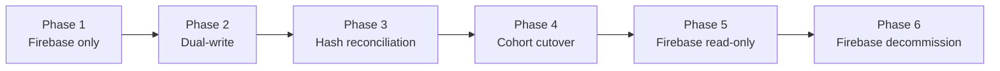

# ADR-0003 — Cloud Provider Portability

| Field | Value |
|-------|-------|
| Status | Accepted |
| Date | 2025-07-01 |
| Author | shivayogih |

---

## Context

Firebase is the planned initial cloud infrastructure provider for Toolly. It offers authentication, cloud storage and real-time database capabilities with a generous free tier suitable for the early-stage product.

However, vendor lock-in to Firebase would create risk:

- Firebase pricing and quotas may become unacceptable at scale.
- Firebase may not meet Indian data-residency requirements under the DPDP Act 2023.
- AWS or a self-hosted solution may become strategically necessary.

The architecture must allow migration from Firebase to AWS (or another provider) without changing domain code or requiring users to re-authenticate or re-upload documents.

---

## Decision

1. Firebase is the **initial** cloud provider, not a permanent dependency.
2. All Firebase SDK calls are confined to data-layer implementations. No Firebase type may appear in domain models, use cases or repository interfaces.
3. All cloud operations use a **provider-neutral sync contract** owned by Toolly:
   - Object keys are Toolly canonical IDs, not Firebase paths.
   - Encryption envelopes are defined by Toolly, not by the Firebase SDK.
   - Metadata schemas are Toolly-owned.
4. The migration path from Firebase to AWS is documented in [FIREBASE_TO_AWS_RUNBOOK.md](../operations/FIREBASE_TO_AWS_RUNBOOK.md).
5. Firebase budget alerts and kill-switch controls are documented in [COST_CONTROLS.md](../operations/COST_CONTROLS.md).

---

## Migration strategy

See the runbook for detailed procedures for each phase.

---

## Consequences

**Positive:**

- Domain code is never rewritten during a provider migration.
- Users are not required to re-upload documents or re-authenticate.
- Canonical IDs are stable across providers.
- Data-residency requirements can be met by switching to a region-specific AWS deployment.

**Negative:**

- Provider-neutral abstraction requires additional interface and mapping code.
- Dual-write phase increases write latency and cloud cost temporarily.
- The migration requires careful hash-reconciliation testing to detect data corruption.

---

## Rejected alternatives

| Alternative | Reason rejected |
|-------------|----------------|
| Direct Firebase SDK calls in domain layer | Creates lock-in; impossible to migrate without rewriting domain code. |
| Use Firebase as permanent provider | Unacceptable data-residency and cost risk at scale. |
| Build self-hosted storage from day one | Premature; increases time-to-market without corresponding benefit at launch. |
