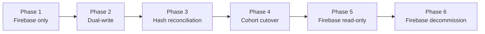

# ADR-0003 — Cloud Provider Portability

| Field | Value |
|-------|-------|
| Status | Accepted |
| Date | 2026-07-23 |
| Author | shivayogih |

---

## Context

Firebase is the approved cloud infrastructure provider for Toolly's initial development and production releases. It provides authentication, cloud storage and real-time database capabilities that are well-suited to Toolly's requirements.

Tight coupling between Firebase SDK types and domain code would create unnecessary risk:

- Indian data-residency obligations under the DPDP Act 2023 may evolve and require review.
- A provider migration may be evaluated in the future if strategic or operational factors require it; that timing is a planning assumption, not a committed deadline.

The architecture must allow a future provider migration without rewriting domain contracts. Identity continuity and encrypted-object migration require explicit evidence before any future cutover.

---

## Current implementation decision

Firebase is Toolly's approved cloud platform for initial development and production releases. AWS code, infrastructure, dependencies and dual-provider runtime support are excluded from the current phase. Migration may be evaluated after approximately two years based on cost, scale, reliability and business needs; this is a planning assumption, not a committed deadline.

Provider-neutral contracts are implemented now to preserve choice without paying the complexity cost of two live providers.

## Decision

1. Firebase is the **approved cloud provider** for Toolly's initial development and production releases. AWS migration may be evaluated after approximately two years based on cost, scale, reliability and business needs; this is a planning assumption, not a committed deadline.
2. All Firebase SDK calls are confined to data-layer implementations. No Firebase type may appear in domain models, use cases or repository interfaces.
3. All cloud operations use a **provider-neutral sync contract** owned by Toolly:
   - Object keys are Toolly canonical IDs, not Firebase paths.
   - Encryption envelopes are defined by Toolly, not by the Firebase SDK.
   - Metadata schemas are Toolly-owned.
4. Migration feasibility procedures are documented in [FIREBASE_TO_AWS_RUNBOOK.md](../operations/FIREBASE_TO_AWS_RUNBOOK.md) for planning purposes only; no migration is being implemented now.
5. Firebase budget alerts and kill-switch controls are documented in [COST_CONTROLS.md](../operations/COST_CONTROLS.md).

---

## Migration feasibility strategy

The following phases describe how a future provider migration could be executed if one is ever required. These phases are documented for planning purposes only; no migration is being implemented in the current product phase.

See the feasibility guide for detailed procedures for each phase.

---

## Consequences

**Positive:**

- Domain code is never rewritten if a provider migration is ever required.
- Canonical contracts make identity and encrypted-object continuity testable before any future cutover.
- Canonical IDs are stable across providers.
- Data-residency requirements can be addressed by switching to a region-specific deployment if migration is ever required.

**Negative:**

- Provider-neutral abstraction requires additional interface and mapping code.
- If a dual-write phase were executed in future, it would temporarily increase write latency and cloud cost.
- A future migration would require careful hash-reconciliation testing to detect data corruption.

---

## Rejected alternatives

| Alternative | Reason rejected |
|-------------|----------------|
| Direct Firebase SDK calls in domain layer | Creates lock-in; impossible to migrate without rewriting domain code if migration is ever required. |
| Implement an alternative provider alongside Firebase from day one | Premature; increases complexity and time-to-market without corresponding benefit at launch. |
| Build self-hosted storage from day one | Premature; increases time-to-market without corresponding benefit at launch. |
