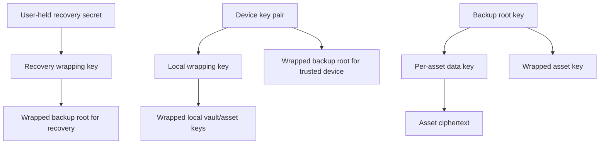

# ADR-0007 — Encryption Envelope and Key Hierarchy

| Field | Value |
|-------|-------|
| Status | Proposed; qualified cryptographic review required |
| Date | 2026-07-23 |
| Author | shivayogih |

## Context

Toolly stores critical document content locally and may optionally back up ciphertext. The design
needs asset isolation, key rotation, multi-device authorization and recovery without giving
Toolly, Firebase or support plaintext key custody.

This ADR fixes the hierarchy and safety contracts. It does not approve a concrete algorithm suite,
entropy value, platform capability claim or recovery format before prototype evidence and review.

## Proposed hierarchy

Roles:

- **Device key pair**: installation identity and device-specific envelope access.
- **Local wrapping key**: protects local vault/asset key material through the platform adapter.
- **Backup root key**: random client-generated key used only to wrap backup asset keys.
- **Per-asset data key**: unique random key for one immutable asset encryption context.
- **Recovery wrapping key**: derived from reviewed user-held recovery material to wrap the backup
  root; never used directly for asset encryption.

Passwords, phone numbers, OTPs and Firebase tokens are never encryption keys or key-derivation
inputs.

## Envelope contract

Every encrypted object carries authenticated metadata:

- envelope family/version and algorithm-suite identifier;
- canonical asset/account scope and ciphertext digest;
- key identifier and wrapping-key version;
- nonce/IV and authentication tag as required by the suite;
- canonical associated-data version and digest;
- ciphertext length and chunk manifest when applicable;
- creation time and migration provenance;
- minimum reader version.

Provider paths and mutable provider timestamps are not authenticated identity.

## Nonce and key-use contract

- A nonce/IV must be unique for every encryption under the same key when the selected suite
  requires uniqueness.
- Per-asset data keys are never reused for different plaintext.
- Retries reuse the original complete immutable ciphertext or allocate a new key/envelope; they
  never encrypt changed plaintext with an old key/nonce pair.
- Concurrency-safe allocation and crash recovery are mandatory.
- Each suite defines enforced key/message/byte usage limits and rotation threshold.
- Nonce values are not secrets but must not be logged as correlation material.
- Property, concurrency, process-death and duplicate-retry tests prove the contract.

## Associated data

Canonical immutable context is authenticated, including envelope version, asset ID, account/vault
scope, object kind and chunk position. Mutable fields such as title, display order and provider
update time are excluded or versioned separately.

## Rotation

| Trigger | Required action |
|---------|-----------------|
| Scheduled policy | Introduce new wrapping-key version; new writes use it |
| Device added | Wrap existing backup root for approved device; do not re-encrypt all assets |
| Device revoked | Stop new envelopes; rotate backup root when risk requires |
| Recovery regenerated | Create new recovery envelope and revoke old version |
| Algorithm/envelope migration | Dual-read, write-new, resumable rewrap/re-encrypt as reviewed |
| Suspected key compromise | Freeze cloud key operations, preserve local access, incident process |

Rotation is resumable and idempotent. Old keys/envelopes are retained only until all required data
is migrated and rollback/restore evidence permits destruction.

## Key loss and corruption

- Corrupt envelopes are quarantined and never replaced with unauthenticated plaintext.
- Missing local key material does not trigger silent vault reset.
- Support cannot create a bypass key.
- If all trusted-device and recovery access is lost, existing encrypted backup may be
  unrecoverable; users must be warned before enabling backup.
- Local-only document export remains available from an already unlocked valid vault.

## Candidate algorithm evaluation

The spike compares platform-supported authenticated-encryption and key-wrapping options for:

- misuse resistance and nonce requirements;
- Android API 26+ and supported Apple platform availability;
- streaming/chunking and large-file behavior;
- hardware/platform key integration;
- performance, memory and thermal impact;
- interoperability and version migration;
- maintained implementation and certification posture.

No custom cryptographic primitive or protocol is permitted.

## Approval evidence

- independent cryptographic review;
- known-answer, tamper, truncation and associated-data substitution tests;
- nonce uniqueness under concurrency/crash/retry;
- representative device capability and performance matrix;
- key rotation, revocation, recovery and lost-key drills;
- old-version restore and algorithm migration fixtures;
- proof Firebase/server/support receives no plaintext keys or document content;
- documented residual risks and accepted owner.

Until approved, encrypted cloud backup remains blocked.
