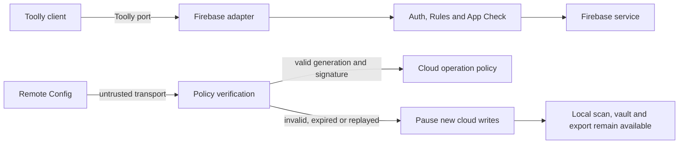

# ADR-0009: Firebase control plane and environment isolation

- **Status:** Accepted
- **Date:** 2026-07-23
- **Owner:** shivayogih
- **Decision scope:** TLY-008

## Context

Toolly is local-first: the encrypted local vault is authoritative and cloud backup is optional.
Firebase is the approved initial cloud provider, while Toolly-owned identities, schemas, ports and
encrypted envelopes preserve provider independence. A Firebase design is still required to prevent
cross-environment data exposure, unbounded spend, OTP abuse, replay, provider leakage and unsafe
operational controls.

The previous cost-control note contained fixed quotas without measured traffic evidence and
described billing alerts as though they could cap spend. It also used a plain Remote Config boolean
as a kill switch. Those assumptions are insufficient for production.

## Decision

1. Development, test, staging and production use separate Firebase/Google Cloud projects. Android
   and iOS builds for the same environment may share that environment's backend; environments do
   not share data, identities, credentials, App Check debug tokens, budgets or deployment
   authority.
2. Local and CI tests use the Firebase Emulator Suite by default. Development and test projects use
   synthetic identities and data. Staging uses approved non-production evidence only. Real user
   data is production-only.
3. Every Firebase service stays disabled or deny-by-default until its entry in
   `config/firebase/service-boundaries.json` and the applicable Production Gate are satisfied.
4. Firebase SDK and Admin SDK types remain inside adapters. Canonical IDs, authorization, retry,
   idempotency, deletion and entitlement policy remain Toolly-owned.
5. Remote Config is only a transport for public operational configuration. Cloud write controls
   use a versioned, signed, expiring and replay-resistant Toolly policy envelope. Remote Config is
   never an authorization source and never stores secrets.
6. Invalid, expired, rolled-back or unverifiable policy disables new background sync and backup
   uploads. It cannot disable local scanning, local vault read/write or local export. Deletion
   intent is persisted and retried through an approved route.
7. Budgets and forecast alerts are notifications, not hard spending caps. Layered safeguards are
   per-operation authorization, App Check, provider quotas, function scaling limits, bounded
   retries, anomaly alerts and the signed cloud-degradation policy. Billing is never automatically
   disabled.
8. Cost-per-user decisions use versioned regional SKU snapshots and measured workload evidence.
   Free, premium-base and premium-allowance-edge scenarios are hypotheses until staging evidence is
   attached.
9. Infrastructure is reproducible with Terraform where Firebase supports it and Firebase CLI/API
   artifacts where it does not. GitHub deployment uses Workload Identity Federation and
   short-lived credentials; service-account key files are prohibited.
10. AWS code, infrastructure, credentials and dependencies remain prohibited. A provider migration
    can be evaluated later only through separate approval.

## Control flow



## Consequences

- Environment isolation and policy contracts are testable before resources exist.
- Project IDs, resource locations, budgets and IAM exports remain explicit operational evidence;
  this ADR does not claim that any project has been provisioned.
- Four projects and isolated monitoring create some administrative overhead.
- Signed-policy implementation requires a reviewed signing suite, canonicalization, managed signing
  key and client verification path. No custom cryptography is authorized by this ADR.
- TLY-009 owns protected deployment and incident operations; TLY-010 owns final product-owner
  authorization.

## Verification

```bash
python3 scripts/validate_firebase_governance.py --self-test
```

The production release must additionally attach the evidence in
`docs/operations/FIREBASE_EVIDENCE_CHECKLIST.md`.

## References

- [Firebase project workflow best practices](https://firebase.google.com/docs/projects/dev-workflows/general-best-practices)
- [Firebase security checklist](https://firebase.google.com/support/guides/security-checklist)
- [Google Cloud billing budgets](https://cloud.google.com/billing/docs/how-to/budgets)
- [Firebase Remote Config policies](https://firebase.google.com/docs/remote-config)
- [Google Cloud Workload Identity Federation](https://cloud.google.com/iam/docs/workload-identity-federation)

References were revalidated on 2026-07-23.
