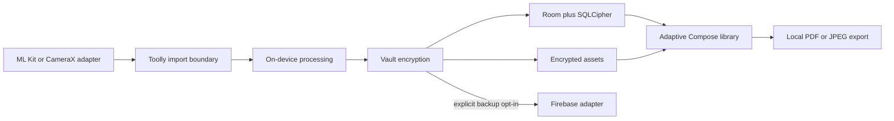

# ADR-0011: Runtime dependencies, adaptive platforms and messaging

- **Status:** Accepted
- **Date:** 2026-07-24
- **Owner:** shivayogih
- **Decision scope:** First Android walking slice and future platform expansion

## Context

Toolly is a privacy-first, offline-first document scanner for a large consumer audience. The first
usable product slice must capture or import documents, detect and edit page boundaries, enhance
pages, store them in an encrypted local vault, display the document library and export PDF or JPEG.

The product must work well on Android phones and tablets, preserve an iOS and iPad path, and avoid
blocking a future web client. Firebase is the approved initial cloud platform, while the local vault
remains authoritative. Dependencies may be used when they are stable, supportable and reviewed,
but document data, credentials and sensitive metadata must not enter telemetry or marketing
systems.

## Decision

### Android scanning

The initial Android scanner uses Google ML Kit Document Scanner behind a Toolly-owned
`DocumentScanner` port. It may provide capture, gallery import, automatic boundary detection,
manual correction, crop, rotation, filters and JPEG/PDF results.

The adapter must account for dynamic delivery through Google Play services, first-use
initialization, unsupported-device failures and the documented minimum device capability. A
CameraX/manual-crop fallback remains an architecture requirement and must be evaluated by the
representative-device spike before production approval.

Document results returned by the scanner are copied into Toolly-controlled processing and
encrypted storage immediately. Temporary plaintext artifacts have bounded ownership and deletion
tests.

### Image loading

Coil 3 is the initial Compose image loader. Glide is not added at the same time.

Vault images use a Toolly-owned Coil fetcher that reads through the vault port and decrypts into
memory. Plaintext vault paths are never exposed to UI code. Disk caching is disabled for decrypted
document pages and thumbnails. Memory caching is bounded and cleared when the vault locks or the
session ends.

### Encrypted local storage

Room provides the metadata and query model. The current `sqlcipher-android` package provides
database encryption; the deprecated `android-database-sqlcipher` package is prohibited.

A random high-entropy SQLCipher passphrase is protected by Android Keystore. It is not hardcoded,
derived directly from a short PIN, stored in DataStore or sent to Firebase. Page images,
thumbnails, PDFs and other large assets are separately encrypted using the accepted Toolly
envelope after ADR-0007 evidence and qualified review.

SQLCipher protects database contents but does not replace file encryption, key lifecycle,
integrity, corruption, backup, migration or recovery tests.

### Firebase services

Firebase SDKs remain inside infrastructure adapters and use the Firebase Android BoM. Main
Firebase modules are used; deprecated `*-ktx` artifacts are prohibited.

The initial service allowlist is:

| Service | Approved purpose |
|---------|------------------|
| Authentication | Login, account linking and session establishment |
| Firestore | Canonical-account mappings, entitlements, encrypted sync manifests and operational records |
| Cloud Storage | Explicitly opted-in, end-to-end encrypted backup objects only |
| Cloud Functions | Privileged idempotent backend operations |
| App Check with Play Integrity | Abuse resistance; never authorization by itself |
| Crashlytics | Sanitized crash diagnostics with prohibited-data tests |
| Remote Config | Public feature and operational configuration under ADR-0009 controls |
| Cloud Messaging | Security, transactional, backup, billing and consented engagement notifications |

Google Analytics, AdMob, In-App Messaging and Firebase AI services are disabled initially.
Enabling one requires a separate dependency, privacy, consent, cost and removal review.

### Notifications and marketing

Notification categories, payload restrictions and marketing-consent rules are defined in
[Notification and Messaging Policy](../product/NOTIFICATION_AND_MESSAGING_POLICY.md).

Security, account, processing, backup and billing notifications are separated from reminders,
product updates, tips and offers. Marketing is explicit opt-in, independently revocable and never
derived from document images, titles, OCR text, folders or other sensitive content.

### Phones, tablets and accessibility

Phones and tablets are first-class targets of the same Android application. Layout decisions use
available window size and posture rather than device-name checks.

Compact layouts use single-pane navigation. Medium and expanded layouts may use navigation rails,
responsive grids and list-detail panes. Landscape, split-screen, resizable windows, foldables,
keyboard input, TalkBack and 200 percent text scaling are included in implementation and test
evidence.

### Future platforms

Shared domain models, use cases, ports, encrypted-envelope formats, notification categories and
sync contracts remain Kotlin Multiplatform compatible.

Platform SDKs stay in adapters:

| Platform | Initial adapters |
|----------|------------------|
| Android phone/tablet | ML Kit, CameraX fallback, SQLCipher, Keystore, Coil and Firebase Android |
| iPhone/iPad | Native camera/scanner, Keychain/Secure Enclave, native encrypted storage and Firebase Apple |
| Web, future | Browser capture/import, Web Crypto, browser storage and provider adapters |

The web UI framework is intentionally undecided. Compose Multiplatform Web, a TypeScript framework
or another production path requires evidence at the time of implementation. Android-only SDK types
must never enter shared contracts.

## Candidate coordinates

The following coordinates are candidates as of 2026-07-24 and are not registry approval by
themselves:

| Capability | Candidate |
|------------|-----------|
| Scanner | `com.google.android.gms:play-services-mlkit-document-scanner:16.0.0` |
| Compose image loading | `io.coil-kt.coil3:coil-compose:3.5.0` |
| Encrypted SQLite | `net.zetetic:sqlcipher-android:4.15.0@aar` |
| Firebase compatibility | `com.google.firebase:firebase-bom:34.16.0` |

Exact versions, transitives, licences, privacy behavior, binary size, 16 KB page compatibility,
CVE status and removal plans must be revalidated and added to the dependency registry in the same
pull request that introduces implementation code.

## Data flow

## Consequences

- The first Android slice can use a mature scanner while retaining a fallback and replacement
  boundary.
- SQLCipher and file-level encryption provide separate database and asset protection.
- Coil simplifies adaptive Compose rendering without allowing plaintext disk caching.
- Firebase capabilities are available without making Firebase the product architecture.
- Vendor metrics and processing disclosures must remain accurate; on-device processing does not
  mean that every SDK emits zero operational metadata.
- Phone/tablet support is implemented now, while iOS, iPad and web remain feasible without forcing
  premature UI sharing.
- Runtime dependencies remain blocked until their registry and benchmark evidence is accepted.

## Verification

Before production approval:

1. Complete TLY-006 scanner, geometry, vault, PDF and representative-device evidence.
2. Verify ML Kit first-use, offline-after-install, unsupported-device and low-memory behavior.
3. Verify CameraX/manual fallback behavior.
4. Verify SQLCipher migration, corruption, key invalidation, 16 KB pages and recovery.
5. Verify Coil never writes decrypted vault content to disk cache.
6. Verify Firebase rules, App Check, deletion, consent withdrawal and encrypted-backup boundaries.
7. Verify notification payload and marketing-consent tests.
8. Verify compact, medium and expanded layouts on physical phones and tablets.
9. Complete dependency registry, lock, verification and SBOM evidence.
10. Obtain product, security and privacy approvals in the Production Gate.

## References

- [ML Kit Document Scanner](https://developers.google.com/ml-kit/vision/doc-scanner/android)
- [ML Kit terms and privacy](https://developers.google.com/ml-kit/terms)
- [Coil documentation](https://coil-kt.github.io/coil/)
- [SQLCipher for Android](https://github.com/sqlcipher/sqlcipher-android)
- [Firebase Android setup](https://firebase.google.com/docs/android/setup)
- [Android adaptive apps](https://developer.android.com/develop/adaptive-apps)
- [Kotlin Multiplatform](https://kotlinlang.org/docs/multiplatform.html)

References were revalidated on 2026-07-24.
