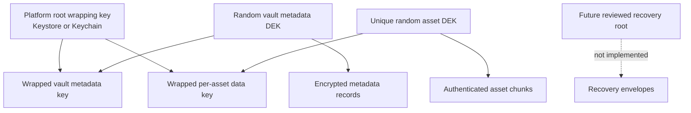

# ADR-0012 — Platform-only Local Vault Cryptography

| Field | Value |
|-------|-------|
| Status | Accepted for implementation; qualified security review and device evidence pending |
| Date | 2026-07-24 |
| Owner | shivayogih |
| Supersedes | ADR-0011 SQLCipher and Coil data-path selections |

## Context

Toolly stores private document images and metadata for a large consumer audience. The local vault
must work offline on Android phones/tablets and iPhone/iPad, remain stable for long-term product
operation and avoid a sensitive-data dependency on a third-party encrypted-database or image
library.

The product-owner decision prohibits SQLCipher and similar third-party encrypted-database
libraries. It also removes Coil and other third-party image loaders from the document data path.
This decision does not permit Toolly to invent a cryptographic primitive. Toolly uses standard
authenticated encryption supplied by each operating system and keeps the storage/envelope code
behind replaceable Toolly-owned ports.

## Decision

### Approved platform primitives

| Capability | Android | Apple |
|------------|---------|-------|
| Authenticated encryption | JCA `Cipher` with `AES/GCM/NoPadding` | CryptoKit `AES.GCM` |
| Random generation | `SecureRandom` | `SecRandomCopyBytes` |
| Local root-key custody | Android Keystore | Keychain with device-appropriate accessibility/access control |
| Authentication gate | Android BiometricPrompt | LocalAuthentication |
| Local files | App-private `noBackupFilesDir` | Application Support with backup-exclusion policy |
| Image decoding | Android bitmap/image APIs | ImageIO/CoreGraphics |

Keys are 256-bit where the platform and approved device baseline support them. AES-GCM uses a
96-bit nonce and 128-bit authentication tag. Exact provider/hardware claims must come from device
evidence; Toolly does not claim every key is hardware-backed.

Deprecated Android `security-crypto`, custom ciphers, ECB mode, unauthenticated encryption,
password/OTP-derived document keys and deterministic nonces are prohibited.

### Dependency boundary

No non-platform dependency may:

- create, receive, persist, unwrap or log a vault encryption key;
- read or write vault plaintext files or metadata;
- implement the vault cipher/envelope;
- persist decrypted document pixels;
- upload plaintext document data.

Google ML Kit may return temporary capture results through the scanner adapter. Toolly immediately
copies those results into bounded app-private staging and encrypts them before persistent
publication. Firebase receives only ciphertext and opaque synchronization metadata after explicit
backup opt-in. Shared UI receives only bounded in-memory render data and never receives vault keys.

### Key hierarchy



- Platform root wrapping keys are non-exportable where the platform supports that property.
- A random vault metadata data-encryption key protects encrypted metadata payloads.
- Every immutable asset receives a unique random data-encryption key.
- Data keys are wrapped by the platform root key and stored only in authenticated envelopes.
- Phone numbers, passwords, OTPs, Firebase tokens and short PINs are never key material.
- Biometrics authorize access to a key; biometric data is never an encryption key.

Cloud/recovery keys are not implemented in this slice. Local account login does not recreate or
bypass missing vault keys.

### Metadata storage

Room/platform SQLite may be used only as a replaceable index and transaction journal. Sensitive
metadata is encrypted before it reaches SQLite.

Plaintext columns are restricted to:

- opaque random record identifiers;
- envelope/schema versions;
- record kind;
- transaction state required for crash recovery;
- ciphertext length and non-secret integrity bookkeeping.

Document titles, OCR text, user filenames, folder names, page dimensions, timestamps, tags,
search terms and business metadata are encrypted authenticated payloads. This design accepts that
an attacker with filesystem access may infer record counts and approximate ciphertext sizes.
Hiding those side channels would require a separately reviewed storage design.

```mermaid
flowchart LR
    Domain["Canonical Toolly metadata"] --> Serialize["Versioned canonical serialization"]
    Serialize --> Encrypt["Platform AES-GCM adapter"]
    Encrypt --> Row["Opaque ID + envelope + ciphertext BLOB"]
    Row --> SQLite["Room / platform SQLite index"]
    SQLite --> Row2["Encrypted row"]
    Row2 --> Verify["Authenticate before decode"]
    Verify --> Domain2["Canonical Toolly metadata"]
```



No user-facing text, sample document, fixed production identifier, secret or project credential is
hardcoded into storage code.

### Asset envelope and chunking

Each asset is immutable and encrypted under a unique random data key. Large assets use independently
authenticated chunks so plaintext does not need to be buffered as one complete file.

Every chunk records:

- envelope family and version;
- opaque asset ID and object kind;
- zero-based chunk index and declared chunk count;
- plaintext and ciphertext lengths;
- a fresh random 96-bit nonce;
- key-envelope reference and key version;
- authenticated associated-data version;
- 128-bit GCM authentication tag.

Associated data includes the immutable vault scope, asset ID, object kind, envelope version, chunk
index and declared chunk count. Reordered, duplicated, substituted, truncated or appended chunks
must fail authentication/publication. A nonce is never reused with the same data key. Retries reuse
the complete immutable ciphertext or allocate a new key and fresh nonces.

The envelope is a storage format, not a cryptographic primitive. Its binary encoding, canonical
associated data and test vectors require qualified review before production.

### Atomic write and recovery

```mermaid
stateDiagram-v2
    [*] --> Staging
    Staging --> Encrypted: encrypt and authenticate every record/chunk
    Encrypted --> Synced: fsync staged files and journal
    Synced --> Published: atomic same-filesystem rename + metadata commit
    Staging --> Quarantined: crash, low storage or validation failure
    Encrypted --> Quarantined: tag, length or digest failure
    Published --> Verified: reopen and authenticate
    Verified --> [*]
    Quarantined --> [*]: bounded cleanup; never publish plaintext
```



- Persistent plaintext files are prohibited.
- Staging plaintext exists only for the shortest scanner/import boundary and has bounded deletion
  ownership; eliminating it entirely remains the preferred adapter behavior.
- Readers expose only fully published, authenticated objects.
- Low-storage, process-death and duplicate retries are idempotent.
- Corrupt ciphertext/envelopes are quarantined, not overwritten.
- Missing or invalidated keys lock the vault and never trigger silent reset.
- Deletion removes database references first, then performs resumable encrypted-object cleanup.

### Image rendering

The platform image decoder reads through a Toolly vault stream. Decrypted pixels remain bounded in
memory, are never written to a disk cache and are released when the screen/session ends or the vault
locks. Thumbnails are separate encrypted assets; they are not plaintext cache entries.

### Cross-platform contract

Shared code owns identifiers, canonical serialization versions, envelope models, error categories
and ports. Platform code owns cryptographic objects and key custody.

```text
VaultMetadataStore
VaultAssetStore
VaultKeyProtector
VaultCipher
VaultRecoveryCoordinator
VaultImageSource
```

Android Keystore, JCA, Apple Keychain, CryptoKit, Room, SQLite, filesystem and Firebase types must
not enter shared domain contracts.

## Failure contract

| Condition | Required result |
|-----------|-----------------|
| Wrong/missing key | Vault locked; no reset or plaintext fallback |
| Authentication-tag failure | Object quarantined and corruption surfaced |
| Truncated/appended/reordered chunks | Reject complete asset |
| Unsupported envelope version | Preserve bytes; require migration-capable reader |
| Interrupted write | Ignore/clean staging; last committed revision remains visible |
| Low storage | Cancel transaction; do not publish partial asset |
| App reinstall without recovery | Local vault may be unrecoverable; user must be warned |
| Firebase unavailable | Local scan, vault, view and export remain available |
| Rooted/compromised OS | No absolute confidentiality claim; risk is detected/communicated where feasible |

Errors exposed to UI are localized categories. Raw crypto exceptions, aliases, file paths, SQL and
key identifiers are not displayed or logged.

## Verification and release gates

Implementation is not production-approved until evidence covers:

1. known-answer and Android/Apple interoperability vectors;
2. nonce uniqueness under concurrency, crash and retry;
3. wrong-key, tag, AAD-substitution, truncation, append, reorder and duplicate-chunk tests;
4. process-death, low-storage, corruption and atomic-publication recovery;
5. platform-key deletion/invalidation and device-lock transitions;
6. migration fixtures retained for every envelope/schema version;
7. phone/tablet and iPhone/iPad performance, memory, storage and thermal measurements;
8. Android API baseline and iOS baseline compatibility;
9. backup exclusion and zero plaintext-cache verification;
10. qualified cryptographic/security review and accepted residual risks.

Cloud backup remains blocked until the recovery/key-sharing design has separate evidence and
approval.

## Long-term maintenance

- Platform adapters are replaceable without changing domain or UI contracts.
- Every released format keeps read/migration fixtures.
- New writes use the newest accepted envelope; old formats remain read-only during migration.
- Cryptographic parameters are versioned and never silently changed.
- Quarterly platform/security review and annual recovery drills are required.
- Toolly keeps an export/re-encrypt/import migration path that never persists an unencrypted
  migration database.
- A future web implementation requires its own Web Crypto and browser-storage evidence.

## Rejected alternatives

| Alternative | Reason |
|-------------|--------|
| SQLCipher or another encrypted-database library | Product-owner decision: sensitive vault must not rely on this third party |
| Coil/Glide for vault images | Non-platform dependency in the document data path |
| Unencrypted Room metadata | Leaks sensitive metadata at rest |
| Custom encryption algorithm | Unacceptable security and review risk |
| Password/PIN as direct key | Low entropy and unsafe recovery coupling |
| Firebase-managed plaintext vault | Violates offline-first and privacy boundaries |
| Silent vault reset after key loss | Causes irreversible hidden data loss |

## References

- [ADR-0002 — Local Vault as Source of Truth](0002-local-vault-source-of-truth.md)
- [ADR-0007 — Encryption Envelope and Key Hierarchy](0007-encryption-envelope-and-key-hierarchy.md)
- [Android cryptography guidance](https://developer.android.com/privacy-and-security/cryptography)
- [Android Keystore](https://developer.android.com/privacy-and-security/keystore)
- [Apple CryptoKit](https://developer.apple.com/documentation/cryptokit)
- [Apple Keychain Services](https://developer.apple.com/documentation/security/keychain-services)
