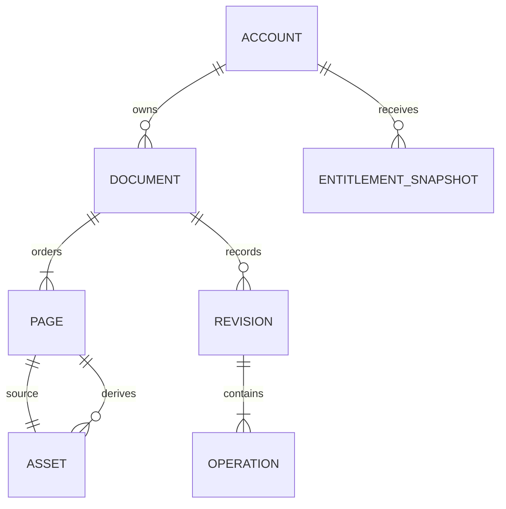

# Canonical Domain Model

This document defines Toolly-owned, provider-neutral models. It is a logical contract, not a
database schema or provider DTO.

## Rules

1. Canonical IDs are generated before persistence or cloud interaction.
2. IDs are opaque lower-case UUID strings and never derive from Firebase paths or user data.
3. Time values are UTC instants; locale formatting belongs to presentation.
4. Models contain no Android, Apple, Firebase, AWS, billing-store or database SDK types.
5. Persisted records carry an explicit schema version.
6. Unknown enum values and optional fields must not crash readers.
7. Document content, OCR text, titles and asset paths are prohibited in logs and analytics.
8. Absence, deletion, corruption and conflict are explicit states.

## Aggregate map



## Canonical identifiers

| Type | Purpose |
|------|---------|
| `ToollyAccountId` | Stable Toolly account |
| `DocumentId` | Document aggregate |
| `PageId` | Logical page |
| `AssetId` | Immutable encrypted binary |
| `RevisionId` | Immutable aggregate revision |
| `OperationId` | Replay-safe mutation |
| `DeviceId` | Revocable app-install key identity |
| `FolderId` | Organisation container |
| `RecipeId` | Processing recipe |
| `EntitlementSnapshotId` | Entitlement history record |

IDs remain stable through retries, backup, restore and provider migration. Reusing one ID type as
another is forbidden.

## Account

`Account` is the ownership aggregate.

| Field | Type | Notes |
|------|------|-------|
| `id` | `ToollyAccountId` | Never a Firebase UID |
| `status` | Pending, Active, Suspended, DeletionPending, Deleted, Unknown | Explicit lifecycle |
| `createdAt`, `updatedAt` | UTC instant | Domain time |
| `schemaVersion` | Positive integer | Contract version |

Provider IDs, phone numbers, email addresses and tokens are not account fields. Infrastructure
maps provider credentials to `ToollyAccountId` behind the authentication port.

## Document and page

`Document` is the consistency boundary for page order and user-visible metadata.

| Model | Required fields |
|-------|-----------------|
| `Document` | `id`, `ownerId`, optional `folderId`, private `title`, unique ordered `pageIds`, `headRevisionId`, lifecycle, timestamps, `schemaVersion` |
| `Page` | `id`, `documentId`, immutable `sourceAssetId`, current `displayAssetId`, optional `recipeId`, normalised crop, rotation, lifecycle, timestamps, `schemaVersion` |

Documents reference pages; they never embed image bytes. Page order is stored once per committed
revision. Processing never overwrites the source asset.

## Asset

An `Asset` is immutable encrypted binary content. Changed bytes require a new `AssetId`.

| Field | Purpose |
|------|---------|
| `id` | Canonical asset identity |
| `kind` | SourceImage, ProcessedImage, Pdf, OcrIndex, Thumbnail, Unknown |
| `mediaType` | Toolly-owned media value |
| `byteLength` | Validated size |
| `plaintextDigest` | Protected local integrity input; never telemetry |
| `ciphertextDigest` | Backup and reconciliation integrity |
| `envelopeVersion` | Encryption-envelope version, not an algorithm claim |
| `storageKey` | Provider-neutral Toolly key |
| `state` | Staged, Committed, DeletionPending, Deleted, Corrupt, Unknown |
| `schemaVersion` | Metadata version |

## Revision and operation

A `Revision` is immutable and represents one committed aggregate transition. It contains:

- `RevisionId`, aggregate type and canonical aggregate ID;
- one parent normally, or multiple parents for an explicit merge;
- ordered operation IDs;
- actor `DeviceId`, local sequence, creation time and schema version.

Wall-clock timestamps alone never select a conflict winner.

An `Operation` is immutable and replay safe:

| Field | Purpose |
|------|---------|
| `id` | Stable `OperationId` |
| `idempotencyKey` | Stable across every retry |
| `aggregateId` | Canonical target |
| `baseRevisionId` | Expected parent |
| `kind`, `payloadVersion`, `payload` | Versioned Toolly mutation |
| `actorDeviceId`, `createdAt` | Origin |
| `state` | Pending, InFlight, Applied, Rejected, Conflict, Unknown |

Payloads reference asset IDs rather than bytes.

## Entitlement snapshot

Entitlements advise premium capability access and never determine ownership of local documents.

| Field | Purpose |
|------|---------|
| `id`, `accountId` | Canonical identity and owner |
| `tier`, `state`, `grants` | Toolly product values |
| `effectiveAt`, `expiresAt`, `cachedAt` | Offline evaluation |
| `freshnessPolicyVersion` | Toolly policy reference |
| `source` | Play, AppStore, Promotion, Support, Unknown |
| `sourceEventIdHash` | Optional protected idempotency reference |
| `schemaVersion` | Contract version |

Expired, stale or unknown entitlement data never deletes, hides or blocks export of local content.

## Invariants

- A committed document references only committed pages and assets.
- Page order is unique and deterministic within a revision.
- Source assets and revisions are immutable.
- A mutation, its revision and outbox entry commit atomically.
- Deletes use tombstones until retention and sync obligations are satisfied.
- Unknown states fail closed for cloud writes and premium grants, but preserve access to
  already-owned local documents.
- Domain equality never depends on provider snapshots, database rows or platform paths.

## Mapping boundary

```text
provider DTO <-> infrastructure record <-> canonical model
vault row    <-> infrastructure record <-> canonical model
```

Canonical models are not serialized directly as provider payloads. Mappers require round-trip,
unknown-field, missing-field and invalid-version contract tests.
