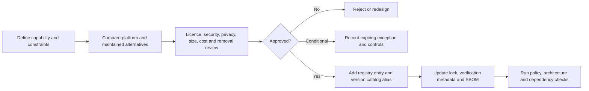

# Dependency Policy

## Scope

This policy covers application libraries, build plugins, native packages, server/tooling packages, GitHub Actions and container images. Test-only and transitive packages are not exempt.

`config/dependencies/policy.json` is the machine-readable control source. `config/dependencies/registry.json` is the approval register.

## Approval workflow



The dependency and its implementation code are reviewed in the same pull request. Approval must not be backfilled after merge.

## Required review fields

| Field | Requirement |
|-------|-------------|
| Capability | Why Toolly needs it and why platform/standard-library code is insufficient |
| Alternatives | At least one alternative or a justified statement that none exists |
| Coordinates | Ecosystem, package, requested version and immutable reference where applicable |
| Ownership | Maintainer, Toolly owner and update responsibility |
| Licence | SPDX expression, primary evidence URL and engineering classification |
| Security | Advisory sources, review date, severity/status and suspicious-maintainer signals |
| Transitives | Resolved count, high-risk packages and graph artifact |
| Size | Measured app/model/download delta by target or explicit non-runtime N/A |
| Privacy | Data categories, network hosts, permissions, collection/defaults and deletion behavior |
| Portability | SDK types confined to adapter boundary and replacement cost |
| Operations | Update cadence, failure mode, rollback and kill switch |
| Removal | Interface boundary, migration/export path and deletion test |

Licence classification is an engineering gate, not legal advice. Unknown, custom, dual or source-available terms require qualified legal review.

## Version and repository rules

- Use exact stable versions. Reject `+`, ranges, `latest.*`, `SNAPSHOT`, branch and unpinned commit selectors.
- Use Maven Central and Google only for approved coordinates; the Gradle Plugin Portal is limited to approved build plugins.
- Reject JCenter, `mavenLocal()`, `flatDir` and arbitrary repository URLs.
- Repository content filters are required when a new reviewed repository is exceptionally approved.
- Do not add a dependency merely because it is already transitive.
- Do not shade or vendor third-party code to bypass the register.

## Gradle controls

When Gradle scaffolding is introduced:

1. Catalog all libraries/plugins in `gradle/libs.versions.toml`.
2. Enable strict locking for all resolvable configurations and commit lockfiles.
3. Generate SHA-256 plus PGP verification metadata where signatures exist.
4. Review generated checksums/signers against independent primary sources.
5. Use strict verification in CI.
6. Export the resolved graph and release SBOM.

Bootstrapping verification metadata trusts the currently downloaded artifacts; therefore generation is not approval.

## GitHub Actions and containers

- Pin Actions to a full 40-character commit SHA and retain a version comment.
- Pin container actions to a SHA-256 image digest.
- Keep `permissions` minimal and job-specific where write access is required.
- Do not use pull-request secrets for untrusted code.
- Dependabot may propose updates; a human reviews source/tag/digest, permissions and release notes.

## Enforcement

Run:

```bash
python3 scripts/validate_dependency_policy.py --self-test
python3 scripts/validate_dependency_policy.py
```

The validator checks registry/policy integrity, version catalog alignment, mutable versions, workflow pins, prohibited repositories and provider/platform source leakage.

Resolved vulnerability and licence scanning is added with the build. If GitHub dependency review is unavailable for the private repository plan, the local validator plus resolved SBOM/advisory scan is the required fallback.
