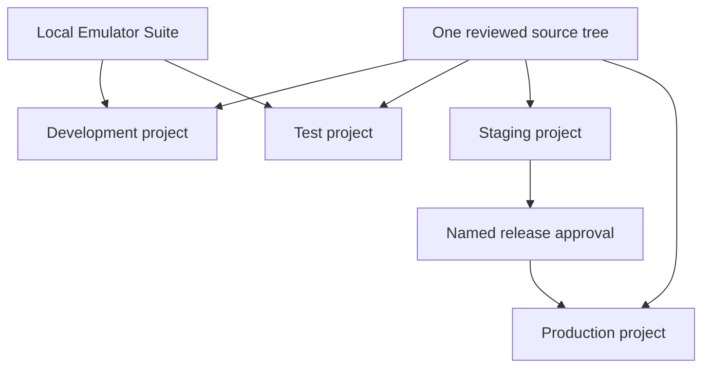

# Firebase environments

This document defines the Firebase-first environment model. It is a design contract, not evidence
that Firebase projects or paid services exist.

The canonical machine-readable contract is
`config/firebase/environments.json`.

## Environment topology

Firebase recommends a separate Firebase project for each development environment. Toolly uses four
isolated projects:

| Environment | Data | Distribution | Default execution | Production access |
|---|---|---|---|---|
| Development | Synthetic only | Developers | Emulator first | None |
| Test | Synthetic only | CI and automated tests | Emulator by default | None |
| Staging | Consent-safe, non-production evidence | Approved internal testers | Real provider integration | None |
| Production | Approved user data | Store releases | Real provider | Named, least-privilege access |

Android and iOS apps for one environment share that environment's backend because they represent
the same Toolly product and canonical account space. A build never selects an environment at
runtime from arbitrary user input.

## Build-to-project binding

The build system eventually generates an immutable environment descriptor containing:

- Toolly environment name;
- Firebase project number and ID;
- registered Android application ID or iOS bundle ID;
- configuration-file digest;
- expected App Check provider;
- operational-policy verification key set and minimum policy version.

Release evidence records the descriptor digest. An unknown, missing or mismatched descriptor fails
closed before Firebase initialization. Production builds reject debug App Check providers,
emulator endpoints, test phone numbers and non-production project IDs.

Project IDs remain `null` in the contract until projects are provisioned and reviewed. No project
ID is guessed in source control.

## Data isolation

- Production data is never copied to development, test, emulators, fixtures or staging.
- Development and test use synthetic identities, phone numbers and documents.
- Staging evidence must be synthetic or separately consented and minimized.
- Export/import, backup restore and support tooling verify environment binding.
- Cross-project service accounts and broad organization-level grants are prohibited by default.
- A canonical identifier from one environment is invalid in every other environment.
- Firebase Auth identities are not canonical Toolly identities and are never shared across
  environments.

## Project bootstrap order

Location choices can be immutable or affect later default resources. Before creating a database or
bucket:

1. approve the environment and billing isolation;
2. select Firestore edition and location from current product, latency, cost and privacy evidence;
3. select compatible Storage and Functions locations and quantify cross-region traffic;
4. record the default Google Cloud resource-location impact;
5. provision deny-by-default Rules before client access;
6. bind Android/iOS app registrations and API restrictions;
7. configure budgets, anomaly alerts, logging sinks and named owners;
8. capture the evidence checklist.

`asia-south1` and `asia-south2` are candidates, not defaults. Firebase Authentication and global
services require service-specific processing disclosure; choosing an India database region does
not justify a blanket India-residency claim.

## Emulator and staging gates

The Emulator Suite is required for deterministic Security Rules and contract tests, but emulator
results do not prove provider quotas, billing, App Check, SMS delivery, regional latency or
production IAM. Staging evidence covers those differences without using production identities or
documents.

Staging deployment requires:

- reviewed rules and indexes;
- service-specific location/processing inventory;
- App Check metrics and rollback plan;
- function scaling, retry and idempotency policy;
- isolated budget plus programmatic notifications;
- synthetic load and abuse test approval;
- no secrets or long-lived service-account key.

## References

- [Firebase project setup best practices](https://firebase.google.com/docs/projects/dev-workflows/general-best-practices)
- [Security across environments](https://firebase.google.com/docs/projects/dev-workflows/general-security-guidelines)
- [Firebase CLI project aliases](https://firebase.google.com/docs/cli)
- [Local Emulator Suite for Security Rules](https://firebase.google.com/docs/rules/emulator-setup)
- [Cloud Firestore locations](https://firebase.google.com/docs/firestore/locations)

References were revalidated on 2026-07-23.
