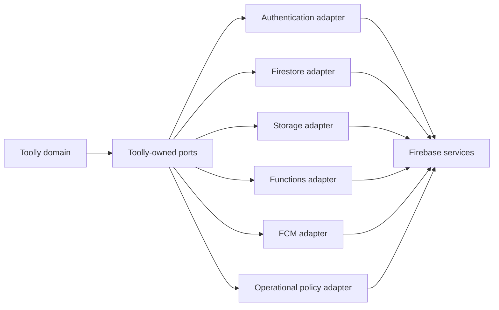

# Firebase service boundaries

Firebase is an infrastructure adapter. The encrypted local vault, canonical IDs and Toolly
contracts remain authoritative.

The canonical service inventory is
`config/firebase/service-boundaries.json`.

## Boundary map

Provider UIDs, snapshots, paths, tasks, timestamps, errors, tokens and SDK types do not cross a
public port.

## Service controls

| Service | Approved purpose | Required controls | Explicit boundary |
|---|---|---|---|
| Authentication | Credential verification | Generic responses, App Check rollout, region policy, provider quota monitoring, canonical mapping | OTP/password/token never persist or enter domain |
| Firestore | Encrypted manifests and minimum account/operation metadata | Deny-by-default Rules, App Check, indexed bounded queries, canonical authorization, emulator tests | No document/OCR/title plaintext |
| Storage | Optional client-encrypted backup | Deny-by-default Rules, App Check, size/type/metadata checks, resumable integrity, deletion verification | Ciphertext only; no identity in paths |
| Functions | Idempotent orchestration | Per-function identity, input caps, max instances, bounded retries, event age, dedupe and safe logs | No document processing or broad Admin SDK access |
| FCM | Generic wake-up/security notification | Trusted-server send, allowlisted payload, token lifecycle, opt-in where required | No sensitive payload; FCM is not end-to-end encrypted |
| Remote Config | Public operational-policy transport | Signed envelope, generation/expiry/environment binding, safe defaults | Not authorization and not a secret store |
| App Check | App/device integrity signal | Monitor, measure, enforce, rollback | Defense-in-depth; never sufficient authorization |
| Crashlytics/Performance | Approved coarse diagnostics | Collection off by default, generated allowlist and capture tests | No content, identity, paths or raw exception messages |
| Analytics | None currently | Disabled in every environment | Separate product/privacy decision required |

## Firestore

Firestore stores only canonical account mappings, encrypted manifests, revision/operation envelopes
and minimum entitlement state. Rules authorize a canonical account scope derived inside the
adapter. Queries are bounded and indexed; listeners are used only when their product value and
read-amplification cost are measured.

The database edition and location are not chosen by this ticket. Provisioning is blocked until the
regional price/SLA, immutable-location impact, privacy assessment and workload model are reviewed.

## Cloud Storage

Only client-encrypted objects are eligible for upload. The adapter derives a versioned object key
from Toolly IDs without embedding phone, email, title or filename. Each upload carries expected
ciphertext length, digest, schema and envelope versions. Completion is acknowledged only after
server metadata and a verification read satisfy the contract.

Rules validate canonical scope, approved path version, object size and bounded metadata. MIME type
is not trusted as proof of content. Resumable operations reuse stable Toolly operation identity;
duplicate completion is idempotent and a different payload at the same key is an integrity error.

Lifecycle rules may remove approved temporary or noncurrent objects after evidence. They never
time-expire a user's live backup object merely to save cost. Account/document deletion remains an
explicit idempotent workflow with verification; retention and soft-delete behavior are recorded per
environment.

## Functions

Each function has one purpose and one least-privilege runtime identity. Configuration defines:

- authentication and App Check requirement;
- maximum request/body size and schema;
- memory, CPU, timeout, concurrency, minimum and maximum instances;
- retryable versus permanent outcomes;
- maximum event age, attempt count and dead-letter behavior;
- idempotency key, dedupe record and side-effect transaction;
- privacy-safe metrics and alert thresholds.

Event-driven delivery can be at least once, so every side effect is idempotent. Infinite retry is
forbidden. Scaling limits are cost safeguards, not availability guarantees, and require load
evidence before production values are approved.

## FCM

FCM sends generic security or backup-status notifications from a trusted server. Payloads contain
only a bounded event type and, where necessary, a short-lived opaque fetch reference. Document
content, OCR, filenames, account/document IDs, storage paths and secrets are prohibited. The app
fetches authorized detail after launch.

## Remote Config and App Check

Remote Config values are accessible to client instances and therefore public. It transports the
signed Toolly operational-policy envelope defined in
`config/firebase/operational-policy.schema.json`; it cannot grant access or enable a sensitive
operation by itself.

App Check is rolled out with metrics before enforcement for existing clients. Production launch
must enforce it for each supported service after valid-client evidence. App Check does not replace
authentication, Security Rules, IAM, operation authorization, rate limits or idempotency.

## References

- [Firebase security checklist](https://firebase.google.com/support/guides/security-checklist)
- [Cloud Storage Rules validation](https://firebase.google.com/docs/storage/security/rules-conditions)
- [Cloud Functions retry semantics](https://firebase.google.com/docs/functions/retries)
- [FCM message types and transport warning](https://firebase.google.com/docs/cloud-messaging/customize-messages/set-message-type)
- [Remote Config policies](https://firebase.google.com/docs/remote-config)
- [App Check enforcement](https://firebase.google.com/docs/app-check/enable-enforcement)

References were revalidated on 2026-07-23.
