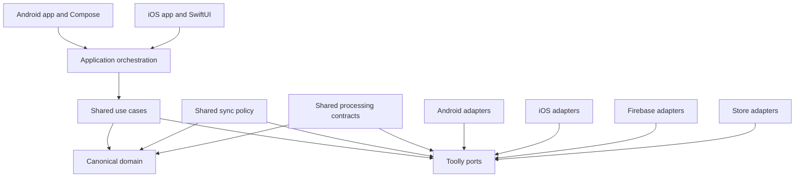

# Module Boundaries

This document defines logical ownership before Gradle and Xcode scaffolding. Names may be refined
by an implementation issue, but dependency direction and forbidden references are binding.

## Dependency graph

Arrows mean “may depend on.” No arrow means no dependency is permitted.

## Logical modules

| Module | KMP/common | Responsibility | Prohibited content |
|--------|------------|----------------|--------------------|
| `foundation` | Yes | Results, errors, clock/ID interfaces, immutable primitives | UI, persistence, providers |
| `domain-model` | Yes | Canonical IDs and models | Use cases, SDK types |
| `domain-contracts` | Yes | Repository/service ports and transactions | Implementations |
| `domain-usecases` | Yes | Product rules and orchestration | Direct DB, network, filesystem or SDK calls |
| `processing-contracts` | Yes | Recipes, geometry, requests/results | Native image or GPU handles |
| `sync-contracts` | Yes | Outbox, retry, conflict and reconciliation policy | Firebase paths/snapshots |
| `platform-bridge` | API shared; implementation native | Camera, keys, filesystem, biometrics, export | Product policy |
| `vault-adapter` | Platform | Encrypted metadata/blob persistence and recovery | UI/provider DTOs |
| `firebase-adapter` | Platform/server | Firebase implementations of Toolly ports | Domain decisions |
| `billing-adapter` | Platform | Play/StoreKit mapping | Store types in domain |
| `android-app` | Android | Compose UI, navigation, composition root | SQL/Firebase in UI |
| `ios-app` | iOS | SwiftUI, navigation, composition root | SQL/Firebase in UI |

A physical module needs an ownership, build-time or replacement boundary; folders alone do not
justify modules.

## KMP versus platform responsibility

| Capability | Shared | Android | iOS |
|------------|--------|---------|-----|
| Models, validation, use cases | Yes | No | No |
| ID and clock contracts | Yes | Adapter | Adapter |
| Camera | Request/result only | CameraX or approved path | AVFoundation or approved path |
| Geometry and recipes | Yes | Engine adapter | Engine adapter |
| Image buffers/GPU resources | No | Native | Native |
| Vault protocol | Yes | Storage/crypto adapter | Storage/crypto adapter |
| Key protection | Objective/port | Keystore capability | Keychain/Secure Enclave capability |
| PDF and share | Request/result only | Native | Native |
| Authentication | Canonical port | Firebase adapter | Firebase adapter |
| Backup/sync | Policy and ports | Firebase adapter | Firebase adapter |
| Entitlement evaluation | Yes | Play mapping | StoreKit mapping |
| UI/accessibility | Design contract | Compose | SwiftUI |
| ViewModels | Evidence pending | Native default | Native default |

Use `expect`/`actual` only for small stable APIs. Wrap large SDK surfaces with interfaces and
dependency injection.

## Dependency rules

1. UI depends on application/use-case APIs, never adapters.
2. Use cases depend on canonical models and ports.
3. Adapters implement ports and map canonical models.
4. Only platform composition roots select concrete adapters.
5. Shared processing/sync policy cannot depend on platform handles.
6. Tests may use deterministic fakes without making fixtures production dependencies.

## Forbidden references

| From | Forbidden examples |
|------|--------------------|
| `foundation`, `domain-*` | Android, Apple platform, Firebase, AWS, billing, database drivers |
| `processing-contracts` | Bitmap, UIImage, pixel buffer, camera/GPU/native handles |
| `sync-contracts` | Firestore snapshots, storage references, provider path conventions |
| UI | SQL, Firebase, encrypted paths, receipt tokens |
| Firebase adapter | UI/navigation, paywall policy, plaintext documents |
| Analytics adapter | Domain document/page/asset objects, titles, OCR, credentials |

The prohibition covers imports, reflection, fully-qualified names, generated schemas, public API
signatures and transitive leakage.

## Public APIs

- Ports use cancellable Toolly result types.
- Streams expose immutable snapshots and explicit terminal/error states.
- Errors use a Toolly taxonomy: Validation, Unavailable, Unauthorized, Conflict, Quota, Corrupt,
  Retryable, Permanent and Unknown.
- Infrastructure exceptions are mapped at adapter boundaries.
- Cancellation is never converted to a generic failure.
- Mutable collections and provider future/task types are not public API.

## Composition

Android and iOS each own one composition root selecting platform, vault, Firebase, billing,
telemetry, clock and scheduler adapters. Product code must not use global service locators.

CI enforcement is defined in
[ARCHITECTURE_FITNESS_FUNCTIONS.md](ARCHITECTURE_FITNESS_FUNCTIONS.md). Exceptions require an ADR,
owner, expiry date and linked issue.
