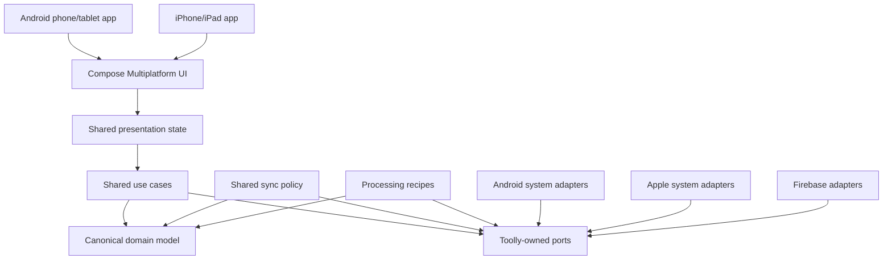

# Architecture Overview

Toolly is a privacy-first, offline-first document scanner for Android phones/tablets and
iPhone/iPad. Firebase is the approved initial cloud platform behind Toolly-owned ports. AWS is not
implemented now.

## Principles

1. The encrypted local vault is the source of truth.
2. Capture, processing, organisation and local export work offline.
3. Cloud backup is optional, explicit, encrypted and resumable.
4. Canonical IDs, schemas, recipes, revisions, operations and object keys belong to Toolly.
5. Provider/platform SDK types remain inside adapters.
6. Source assets and revision history are immutable.
7. User mutations, revisions and outbox entries commit atomically.
8. Sync uses revision ancestry and preserves divergence; timestamps cannot silently overwrite data.
9. Firebase is implemented now; future provider evaluation does not add current dual-provider code.
10. Sensitive document and identity data never enters logs or analytics.
11. Toolly-created UI, behavior, localization and accessibility are shared across Android and iOS.
12. Platform differences are limited to operating-system adapters and are recorded in the parity
    matrix.

## System structure

Dependencies point toward canonical policy and contracts. Android and iOS composition roots supply
the platform/provider implementations without changing shared product behavior.

## Core data flow

Local success does not depend on cloud availability.

## Responsibility summary

| Shared KMP and Compose Multiplatform | Platform-specific adapters |
|--------------------------------------|----------------------------|
| Canonical models and IDs | Camera and native image buffers |
| Use cases, validation and presentation state | Key protection and encrypted storage implementation |
| Toolly-created UI, tokens and navigation destinations | Document picker, PDF/share/print integration |
| Localization and accessibility semantics | GPU/native processing engine |
| Repository/service ports | Firebase SDK binding |
| Processing recipes and geometry | FCM/APNs binding |
| Sync, outbox and conflict policy | Play Billing/StoreKit mapping |
| Entitlement evaluation | OS permissions and lifecycle bridge |

Operating-system-controlled surfaces may differ visually. Their input, result, privacy and product
outcomes must satisfy the same shared contract.

## Contract index

| Contract | Purpose |
|----------|---------|
| [Platform parity](PLATFORM_PARITY.md) | Shared UI decision, allowed platform differences and parity gate |
| [Canonical domain model](CANONICAL_DOMAIN_MODEL.md) | Account, document, page, asset, revision, operation and entitlement |
| [Module boundaries](MODULE_BOUNDARIES.md) | KMP/platform responsibilities and forbidden dependencies |
| [Vault and processing](VAULT_AND_PROCESSING_CONTRACTS.md) | Transactions, recovery and recipe versioning |
| [Sync and Firebase](SYNC_AND_FIREBASE_CONTRACTS.md) | Outbox, conflict, idempotency and adapter tests |
| [Firebase environments](FIREBASE_ENVIRONMENTS.md) | Project isolation, build binding and environment gates |
| [Firebase service boundaries](FIREBASE_SERVICE_BOUNDARIES.md) | Auth, data, storage, functions, messaging, policy and observability boundaries |
| [Schema evolution](SCHEMA_EVOLUTION.md) | Compatibility, migration and rollout |
| [Fitness functions](ARCHITECTURE_FITNESS_FUNCTIONS.md) | CI enforcement contracts |
| [Secure PDF/JPEG export](TLY006D_SECURE_PDF_JPEG_EXPORT.md) | Consent, platform APIs, plaintext boundary and cleanup |

## ADR index

- [ADR-0001 — KMP and shared UI boundary](../adr/0001-kotlin-multiplatform-boundary.md)
- [ADR-0002 — Local vault](../adr/0002-local-vault-source-of-truth.md)
- [ADR-0003 — Cloud portability](../adr/0003-cloud-provider-portability.md)
- [ADR-0004 — Authentication/account](../adr/0004-authentication-and-account-boundary.md)
- [ADR-0005 — Canonical data/operations](../adr/0005-canonical-data-and-operation-model.md)
- [ADR-0006 — Outbox/conflicts](../adr/0006-local-outbox-and-conflict-policy.md)
- [ADR-0007 — Encryption envelope/key hierarchy](../adr/0007-encryption-envelope-and-key-hierarchy.md)
- [ADR-0008 — Dependency/supply-chain governance](../adr/0008-dependency-and-supply-chain-governance.md)
- [ADR-0009 — Firebase control plane/environment isolation](../adr/0009-firebase-control-plane-and-environment-isolation.md)
- [ADR-0010 — First-party CI trust boundary](../adr/0010-first-party-ci-trust-boundary.md)
- [ADR-0011 — Runtime dependencies, adaptive platforms and messaging](../adr/0011-runtime-dependencies-adaptive-platform-and-messaging.md)

- [ADR-0012 — Platform-only local vault cryptography](../adr/0012-platform-only-local-vault-cryptography.md)
