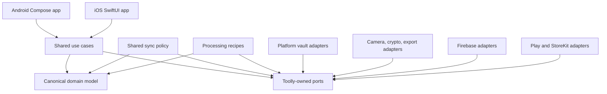
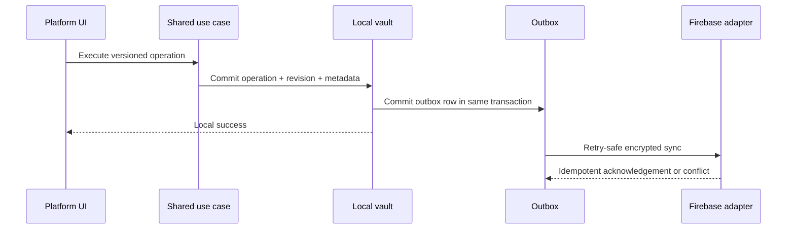

# Architecture Overview

Toolly is a privacy-first, offline-first document scanner for Android and iOS. Firebase is the
approved initial cloud platform behind Toolly-owned ports. AWS is not implemented now.

## Principles

1. The encrypted local vault is the source of truth.
2. Capture, processing, organisation and local export work offline.
3. Cloud backup is optional, explicit, encrypted and resumable.
4. Canonical IDs, schemas, recipes, revisions, operations and object keys belong to Toolly.
5. Provider/platform SDK types remain inside adapters.
6. Source assets and revision history are immutable.
7. User mutations, revisions and outbox entries commit atomically.
8. Sync uses revision ancestry and preserves divergence; timestamps cannot silently overwrite data.
9. Firebase is implemented now; future provider evaluation does not add current dual-provider code.
10. Sensitive document and identity data never enters logs or analytics.

## System structure

Dependencies point toward canonical policy and contracts. Platform/provider implementations plug
in through composition roots.

## Core data flow

Local success does not depend on cloud availability.

## Responsibility summary

| Shared KMP | Platform-specific |
|------------|-------------------|
| Canonical models and IDs | Camera and image buffers |
| Use cases and validation | Key protection and encrypted storage implementation |
| Repository/service ports | PDF/share integrations |
| Processing recipes/geometry | GPU/native processing engine |
| Sync, outbox and conflict policy | Firebase SDK adapter |
| Entitlement evaluation | Play Billing/StoreKit mapping |

Native UI remains the default until Compose Multiplatform evidence changes ADR-0001.

## Contract index

| Contract | Purpose |
|----------|---------|
| [Canonical domain model](CANONICAL_DOMAIN_MODEL.md) | Account, document, page, asset, revision, operation and entitlement |
| [Module boundaries](MODULE_BOUNDARIES.md) | KMP/platform responsibilities and forbidden dependencies |
| [Vault and processing](VAULT_AND_PROCESSING_CONTRACTS.md) | Transactions, recovery and recipe versioning |
| [Sync and Firebase](SYNC_AND_FIREBASE_CONTRACTS.md) | Outbox, conflict, idempotency and adapter tests |
| [Firebase environments](FIREBASE_ENVIRONMENTS.md) | Project isolation, build binding and environment gates |
| [Firebase service boundaries](FIREBASE_SERVICE_BOUNDARIES.md) | Auth, data, storage, functions, messaging, policy and observability boundaries |
| [Schema evolution](SCHEMA_EVOLUTION.md) | Compatibility, migration and rollout |
| [Fitness functions](ARCHITECTURE_FITNESS_FUNCTIONS.md) | CI enforcement contracts |

## ADR index

- [ADR-0001 — KMP boundary](../adr/0001-kotlin-multiplatform-boundary.md)
- [ADR-0002 — Local vault](../adr/0002-local-vault-source-of-truth.md)
- [ADR-0003 — Cloud portability](../adr/0003-cloud-provider-portability.md)
- [ADR-0004 — Authentication/account](../adr/0004-authentication-and-account-boundary.md)
- [ADR-0005 — Canonical data/operations](../adr/0005-canonical-data-and-operation-model.md)
- [ADR-0006 — Outbox/conflicts](../adr/0006-local-outbox-and-conflict-policy.md)
- [ADR-0007 — Encryption envelope/key hierarchy](../adr/0007-encryption-envelope-and-key-hierarchy.md)
- [ADR-0008 — Dependency/supply-chain governance](../adr/0008-dependency-and-supply-chain-governance.md)
- [ADR-0009 — Firebase control plane/environment isolation](../adr/0009-firebase-control-plane-and-environment-isolation.md)
