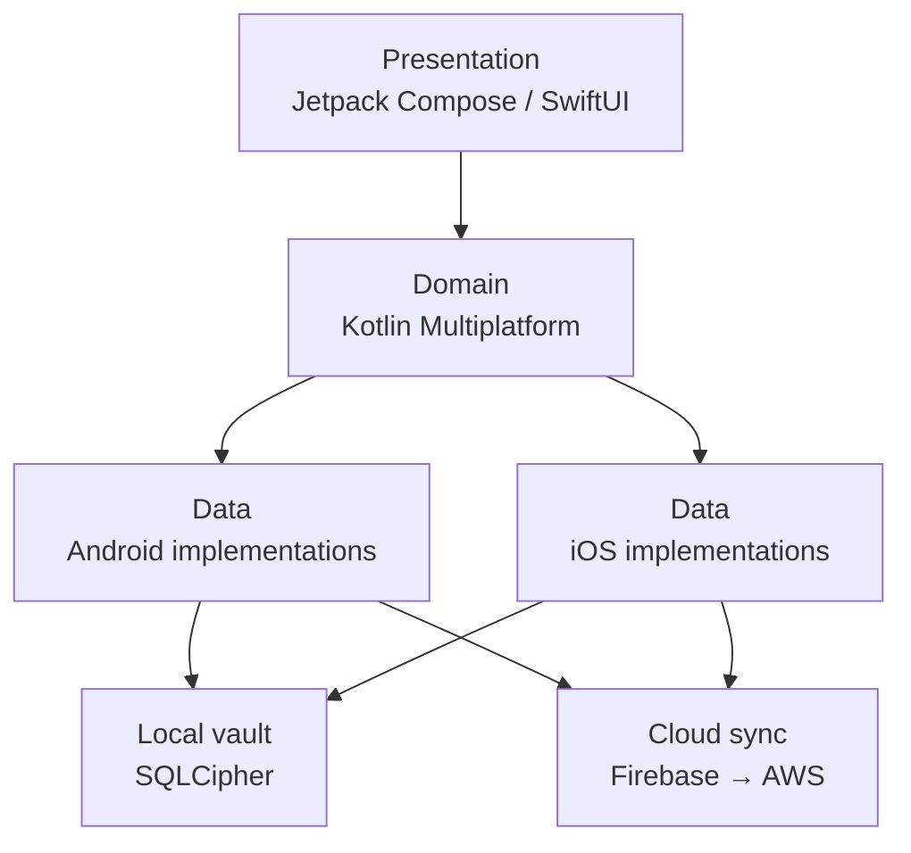
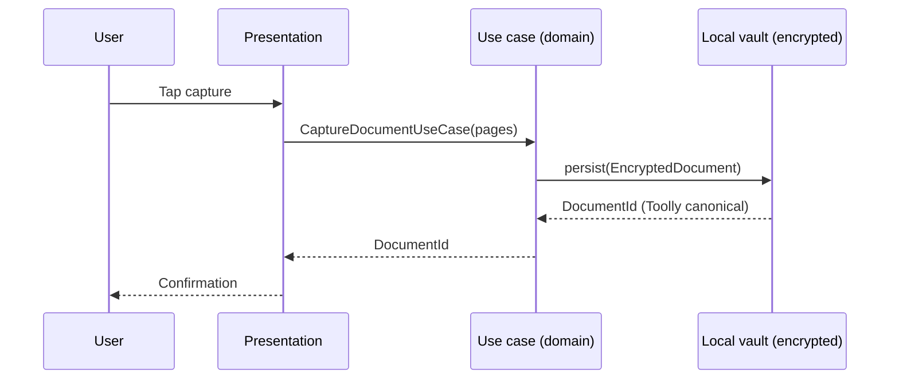
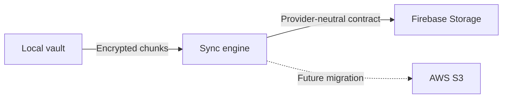

# Architecture Overview

This document describes the high-level architecture of Toolly: Document Scanner.

---

## Product summary

Toolly is a privacy-first, offline-first document-scanning application for Android and iOS.

- **Canonical domain:** toollyscan.com · toollyscan.in
- **Android application ID:** com.toollyscan.app
- **iOS bundle ID:** com.toollyscan.app
- **Initial market:** India
- **Launch languages:** English · Hindi · Kannada

---

## Architecture principles

1. The encrypted local vault is the source of truth.
2. Capture, processing, organisation and local export must work offline.
3. Cloud backup is optional, explicit, encrypted and resumable.
4. Firebase is the initial infrastructure provider, not a domain dependency.
5. Firebase and future AWS implementations must remain behind Toolly-owned contracts.
6. Canonical IDs, schemas, encryption envelopes, sync contracts and object keys belong to Toolly.
7. Firebase UID must not become the canonical document-owner ID.
8. Provider SDK types must not enter shared domain models.
9. Document content and personal information must never enter logs or analytics.
10. Production feature implementation is blocked until the production-readiness gate is approved.

---

## Layer model

Dependencies flow inward. The domain layer has no dependency on Android, iOS, Firebase or AWS.

---

## Module boundary

| Layer | Shared (KMP) | Android-only | iOS-only |
|-------|-------------|-------------|---------|
| Domain models | Yes | No | No |
| Use cases | Yes | No | No |
| Repository interfaces | Yes | No | No |
| Repository implementations | No | Yes | Yes |
| Presentation (ViewModel) | Evaluated per ADR-0001 | Fallback | Fallback |
| UI | No | Compose | SwiftUI |

See [ADR-0001](../adr/0001-kotlin-multiplatform-boundary.md) for the KMP feasibility boundary.

---

## Data flow — offline capture

---

## Canonical identity

- Every document is assigned a `DocumentId` (UUID v4) by Toolly before any cloud write.
- Every account is assigned a `ToollyAccountId` by Toolly. Firebase UID is stored as a provider credential, not as the primary identity.
- Canonical IDs are stable across provider migrations.

See [ADR-0004](../adr/0004-authentication-and-account-boundary.md).

---

## Cloud sync (optional)

The sync engine operates against a provider-neutral contract. The Firebase implementation and the future AWS implementation are interchangeable without changes to domain code.

See [ADR-0003](../adr/0003-cloud-provider-portability.md).

---

## Related documents

| Document | Link |
|----------|------|
| ADR-0001 | [Kotlin Multiplatform boundary](../adr/0001-kotlin-multiplatform-boundary.md) |
| ADR-0002 | [Local vault source of truth](../adr/0002-local-vault-source-of-truth.md) |
| ADR-0003 | [Cloud provider portability](../adr/0003-cloud-provider-portability.md) |
| ADR-0004 | [Authentication and account boundary](../adr/0004-authentication-and-account-boundary.md) |
| Security baseline | [docs/security/SECURITY_BASELINE.md](../security/SECURITY_BASELINE.md) |
| Firebase-to-AWS runbook | [docs/operations/FIREBASE_TO_AWS_RUNBOOK.md](../operations/FIREBASE_TO_AWS_RUNBOOK.md) |
