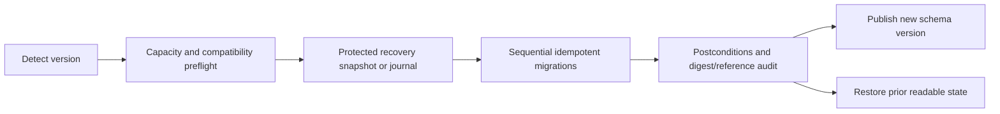

# Schema Evolution and Compatibility

Toolly must tolerate delayed mobile updates, interrupted migrations and long-lived encrypted
backups. Compatibility is explicit and independently versioned.

## Version axes

| Axis | Covers | Independent because |
|------|--------|---------------------|
| Domain schema | Canonical model fields/states | Product evolves separately from storage |
| Vault schema | Tables, indexes, journals | Platform persistence changes |
| Wire schema | Metadata/operation envelopes | Old clients remain online |
| Processing recipe | Ordered processing semantics | Engines can evolve |
| Encryption envelope | Wrapped keys/ciphertext metadata | Security design evolves |
| Object-key strategy | Provider path mapping | Provider layout changes |
| Entitlement policy | Grant evaluation/freshness | Store/product policy evolves |

No single “app version” substitutes for these versions.

## Compatibility envelope

Every persisted or synchronized envelope carries:

- schema family and version;
- minimum reader version;
- canonical record ID;
- payload digest;
- creation time;
- optional migration provenance;
- extension area for unknown optional fields.

Readers:

- accept supported versions;
- preserve unknown optional fields across round trips where required;
- reject unknown mandatory semantics safely;
- never partially interpret a newer encryption envelope;
- retain the prior local revision and provide a clear upgrade/recovery result.

## Change classification

| Change | Default policy |
|--------|----------------|
| Add optional field with safe default | Backward compatible |
| Add enum value | Compatible only with explicit `Unknown` handling |
| Rename/remove field | Breaking; use read-old/write-new migration |
| Change field meaning/type | Breaking; create a new version |
| Add optional operation/recipe step | Compatible only when safely ignorable |
| Add mandatory operation/recipe step | Requires reader capability gate |
| Change ID or digest semantics | New schema family/ADR |
| Change encryption envelope | Security review plus restore/rotation drill |

## Local vault migration

Rules:

1. Migrations are ordered, resumable and idempotent.
2. Each step has preconditions and postconditions.
3. Destructive cleanup occurs only after the new version is verified.
4. Failure restores or preserves the last readable state; it never silently recreates an empty
   vault.
5. Large backfills are chunked, checkpointed and bounded for memory, battery and thermal impact.
6. Migration tests use synthetic/redacted fixtures from every released schema.
7. Downgrade is not assumed. An older app detects unsupported state and fails safely.

## Wire rollout

For a breaking wire change:

1. add dual-read capability;
2. deploy readers before writers;
3. observe privacy-safe compatibility/error metrics;
4. enable new writes by signed remote policy and cohort;
5. backfill only when necessary and resumably;
6. retain rollback to old writes during the approved window;
7. retire old reads only after the supported-client policy and backup-restore evidence allow it.

An exact client support window is a product/operations decision; it must be recorded before the
first production schema is retired.

## Backup compatibility

Backup manifests identify every required schema, recipe, object-key and encryption-envelope
version. Restore performs preflight before writing. Unsupported backup is kept intact and returns
an upgrade/support path; it is never deleted or partially imported.

## Migration registry

Each migration entry records:

- source and target version;
- owner and approving ADR/issue;
- compatibility classification;
- affected records/assets;
- capacity and performance estimate;
- forward function and recovery strategy;
- fixture set and executed evidence;
- rollout/rollback criteria;
- earliest safe cleanup version.

## Required CI evidence

- golden fixtures for every released canonical/wire version;
- read-old/write-current and unknown-field tests;
- migration interruption at every checkpoint;
- duplicate migration execution;
- insufficient-storage and corruption tests;
- backup produced by old version restored by current version;
- current writer rejected safely by unsupported old reader;
- schema diff classified as compatible or explicitly approved breaking change.

See [ARCHITECTURE_FITNESS_FUNCTIONS.md](ARCHITECTURE_FITNESS_FUNCTIONS.md).
