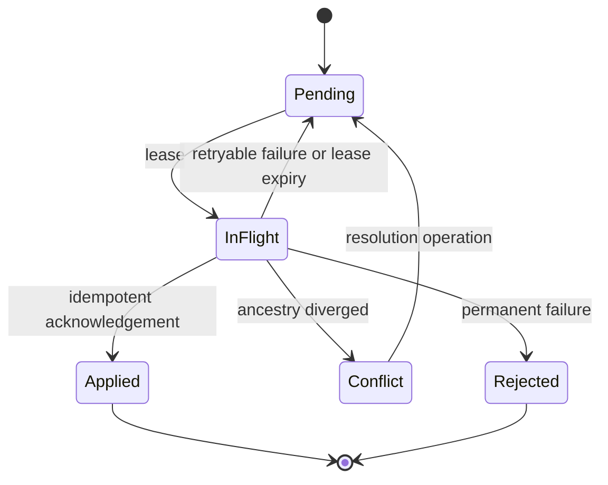

# Sync and Firebase Contracts

Sync is optional delivery and reconciliation for encrypted backup and future multi-device use. It
is never the authority for local ownership.

## Ports

| Port | Responsibility |
|------|----------------|
| `SyncCoordinator` | Provider-neutral push, pull and reconciliation |
| `OutboxStore` | Atomically stores operations with revisions |
| `RemoteMetadataPort` | Versioned encrypted manifests/operation envelopes |
| `BackupObjectPort` | Encrypted chunk upload/download/delete by Toolly key |
| `SyncCheckpointStore` | Resumable cursors and attempt state |
| `ConnectivityPort` | Capability signal, not reachability guarantee |
| `AuthSessionPort` | Scoped authorization without credential leakage |
| `EntitlementVerificationPort` | Verified store event to canonical snapshot |

## Outbox

The outbox row commits with its operation and revision. Delivery is at least once; remote
application is effectively once through stable operation IDs and idempotency keys.

## Retry

- Persisted bounded exponential backoff uses jitter.
- Authentication, quota, validation, conflict and transient failures remain distinct.
- Restart/reboot does not change idempotency identity.
- One poisoned aggregate does not block unrelated aggregates.
- Per-aggregate ordering is preserved.
- A signed backup kill switch can stop cloud work without disabling local scanning.
- Numeric thresholds belong to TLY-008 and require evidence.

## Conflict

Timestamp-only last-write-wins is forbidden.

1. Push when remote head is an ancestor of local head.
2. Apply staged remote descendants when local head is an ancestor of remote head.
3. Preserve both branches when neither is an ancestor.
4. Auto-merge only documented commutative operations.
5. Resolution creates a revision with both heads as parents.
6. Cloud state never silently overwrites a committed local revision.

Even V1 backup divergence is preserved as a conflict rather than discarded.

## Idempotency and reconciliation

Logical operations reuse one `OperationId` and key; object uploads use Toolly key plus ciphertext
digest; metadata compares expected parent; deletes are replayable tombstones. Reusing a key with a
different payload is a permanent integrity error.

Reconciliation compares canonical IDs, revisions, object keys, ciphertext digests/lengths, schema
and envelope versions, tombstones and acknowledgements. Provider timestamps are not truth.

## Firebase boundary

Firebase is the only cloud adapter implemented now. AWS and dual-provider runtime behavior are
excluded.

Allowed:

- map Firebase identities to canonical account mappings;
- store versioned encrypted metadata;
- transfer encrypted objects through resumable APIs;
- enforce scoped authorization, quota and App Check;
- map provider failures to Toolly errors;
- expose privacy-safe operational metrics;
- support emulator-backed contract tests.

Forbidden across public boundaries:

- Firebase UID as owner ID;
- Firebase snapshots, references, tasks, timestamps or paths;
- unmapped provider error codes;
- raw tokens, phone numbers or plaintext document content;
- provider retry behavior as product policy.

Provider paths are derived inside the adapter from Toolly IDs and a versioned key strategy.

## Authentication adapter

The adapter supports phone OTP, email/password, Google and Apple Sign In behind canonical
requests/results. Tokens and credential objects remain infrastructure-only. Account linking,
reauthentication and deletion outcomes are explicit. Trusted-device and recovery guarantees remain
pending TLY-005 evidence.

## Contract tests

The same suite runs against a deterministic fake, Firebase Emulator Suite and an approved staging
project. It covers CRUD envelopes, interrupted/duplicate resumable transfers, idempotency,
stale-parent conflict, unknown versions, digest corruption, expired authorization, deletion, quota,
out-of-order events, the backup kill switch, public API leakage and sensitive logging.

Production credentials and real personal documents are forbidden in tests. TLY-008 owns Firebase
projects, rules, indexes, budgets and thresholds; TLY-009 owns deployment and operations.
