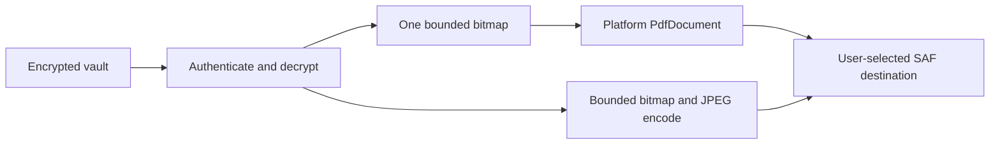

# TLY-006D — Secure PDF and JPEG Export

- **Issue:** #24
- **Status:** Android executable slice; benchmark and Apple evidence pending
- **Platforms:** Android phones and tablets

## Product outcome

An opened encrypted document can be exported as:

- one single-page or multi-page PDF to a user-selected document destination; or
- privacy-sanitized JPEG pages to a user-selected directory.

The path works offline, requests no storage/media permission and adds no runtime dependency.

## Security boundary

The user selecting a destination is the explicit consent boundary where document plaintext leaves
the Toolly vault. Toolly does not create a plaintext export in app cache, retain a provider URI,
request broad storage access or log document metadata, names, paths or bytes.

## PDF behavior

- Android `PdfDocument` is the only PDF engine.
- A4 portrait or landscape is selected from each page orientation.
- At most one page bitmap, sampled to a bounded export dimension, exists in memory.
- The bitmap is recycled after its PDF page is finished.
- Cancellation is propagated and the newly created destination is deleted on failure when the
  selected document provider supports deletion.

## JPEG behavior

- Each authenticated page is decoded to one bounded bitmap and re-encoded with the Android
  platform JPEG encoder.
- Multi-page documents create one child document per page through `DocumentsContract`.
- Source EXIF and other encoded metadata are not copied to the exported JPEG.
- The bitmap is recycled immediately after the destination page is encoded.
- If any page fails, created child documents are deleted in reverse order when the selected
  provider supports deletion.

## Failure and privacy properties

| Condition | Result |
|---|---|
| User cancels picker | No vault read or output write |
| Missing/corrupt encrypted asset | Fail closed; incomplete output cleanup attempted |
| Wrong/missing key or AAD mismatch | Fail closed before successful export |
| Destination unavailable or full | Retryable failure; incomplete output cleanup attempted |
| Coroutine cancellation | Propagated; cleanup attempted |
| App cache inspection | No export plaintext exists |

An external document provider owns a destination after user selection. Toolly cannot guarantee
that every provider honors truncation or deletion; partial-output behavior remains a provider and
device acceptance test.

## Platform parity

`DocumentExportFormat` and `DocumentExportOutcome` are provider-neutral. Android uses
`PdfDocument`, `ContentResolver` and the Storage Access Framework behind the composition root.
The corresponding iPhone/iPad adapter must use Apple platform APIs behind the same product states.
Android/Apple output and UX parity remains a production gate and is not claimed by this slice.

## Evidence

Automated sources cover:

- multi-page platform PDF generation;
- one-page-at-a-time bitmap recycling;
- platform JPEG generation without copying source metadata;
- missing authenticated bitmap failure without PDF publication;
- Android permission policy and dependency-policy checks.

Representative devices must still provide file-size, fidelity, latency, peak-memory, cancellation,
low-storage, provider, Unicode metadata and multi-page evidence before issue #24 is accepted.
