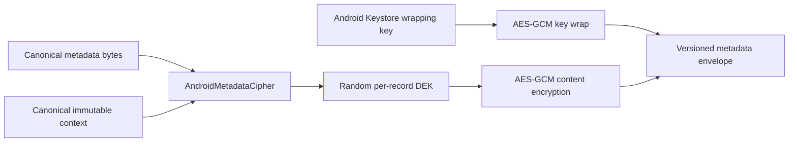

# TLY-006F — Android Platform Vault Foundation

- **Issue:** #26
- **ADR:** ADR-0012
- **Status:** Candidate implementation; not a complete production vault
- **Date:** 2026-07-24

## Included

- canonical metadata associated-data encoding;
- versioned bounded metadata-envelope codec;
- unique random per-record AES-256 data key;
- Android Keystore AES-GCM wrapping key;
- platform AES-GCM metadata encryption and authentication;
- fail-closed invalid-envelope, tamper, AAD-substitution and missing-key behavior;
- Android platform image decoding without a third-party loader or persistent plaintext cache.

## Not included

- persistent Room/SQLite metadata adapter;
- encrypted page/PDF/thumbnail asset chunks;
- scanner-to-encrypted-vault replacement;
- key rotation, backup or multi-device recovery;
- Apple Keychain/CryptoKit adapter;
- production cryptographic approval.

The existing `AppPrivateDocumentRepository` remains a development-only plaintext candidate and must
not ship to beta or production.

## Boundary

Android Keystore and JCA types remain inside `vault/crypto`. The codec contains no Android type and
can become a shared contract only after Android/Apple interoperability vectors pass.

## Evidence

JVM tests cover canonical purpose separation and strict envelope framing. Android instrumented tests
cover:

- encryption/decryption through separate adapter instances;
- absence of the plaintext fixture in the encoded envelope;
- ciphertext tamper rejection;
- associated-data substitution rejection;
- missing wrapping-key failure without reset;
- distinct envelopes for repeated encryption.

This slice uses test-only synthetic bytes. It contains no hardcoded production content, user data,
credential, API key or Firebase identifier.
