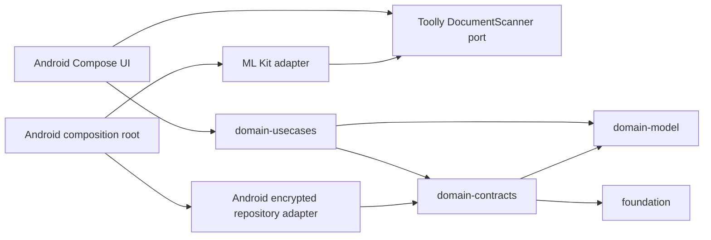

# TLY-011 Capture-to-Library Walking Slice

## Product outcome

This slice replaces the isolated capture harness with the first offline product loop:

```text
Document library → ML Kit capture → review → staged local save → library → reopen
```

The application works without Firebase configuration, network access, account sign-in, broad
storage permission or a commercial document SDK.

## Dependency direction



The domain packages intentionally contain no Android, Firebase, ML Kit, SQL, filesystem or
provider types. TLY-011 initially keeps them in the reviewed Android Gradle module to avoid adding
a build plugin solely for scaffolding. The later physical KMP-module extraction changes build
targets without changing these dependency rules or public APIs.

## Encrypted local transaction

The TLY-011 adapter publishes a document with a same-filesystem staged directory:

1. resolve Toolly-owned temporary asset IDs inside the Android adapter;
2. validate each complete JPEG and encrypt it into independently authenticated chunks;
3. encrypt and fsync the versioned manifest;
4. write and fsync the commit marker;
5. atomically rename the transaction directory into the visible document directory;
6. delete incomplete staging directories when the repository reopens.

Readers only expose directories containing a valid commit marker and fully authenticated metadata
and assets. Retries with the same document ID are idempotent.

## Security status

TLY-006F replaces the development-only plaintext adapter with the ADR-0012 Android
Keystore/JCA implementation. Sensitive metadata is encrypted before persistence, each immutable
asset has a unique key and authenticated chunk sequence, and viewer plaintext remains in bounded
memory only.

The former version-one plaintext format is migration input only and is removed after its encrypted
replacement reopens successfully. Qualified cryptographic review, representative-device evidence,
Apple interoperability and recovery approval remain production gates.

## Focused acceptance

- canonical IDs reject provider paths and non-canonical values;
- invalid or duplicate captured pages fail before persistence;
- incomplete writes are never listed;
- committed documents reopen through a new repository instance;
- no persistent plaintext image cache is created for document pixels;
- the manifest requests no Android permission;
- build, lint, unit tests and instrumented-test APK compilation pass;
- debug APKs remain downloadable from first-party GitHub Actions.

Full phone/tablet, performance, accessibility, localization, Figma and cryptographic evidence is a
beta/release gate. Critical crash, data-loss, privacy and architecture violations remain immediate
development blockers.
