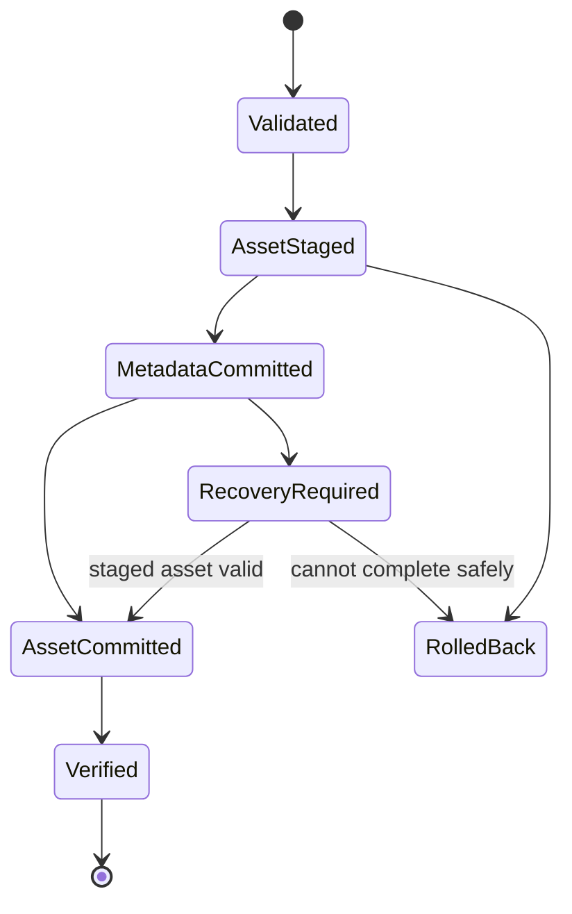

# Local Vault and Processing Contracts

This document defines atomicity, interruption recovery and versioned processing. Exact database,
filesystem and cryptographic mechanisms remain evidence pending.

## Vault responsibility

The encrypted local vault is the source of truth for canonical metadata, immutable encrypted
assets, revisions, operations, outbox/checkpoints, entitlement cache, recipes and recovery journal.
Cloud state cannot directly mutate committed vault records.

## Logical transaction

A mutation atomically commits:

1. validated operation;
2. immutable revision;
3. aggregate metadata;
4. asset intent or tombstone when applicable;
5. outbox entry when sync is enabled;
6. recovery-journal state.

Database and filesystem writes are not assumed to share a platform transaction. Asset mutations
therefore use a recoverable staged protocol.

## Properties

| Property | Contract |
|----------|----------|
| Atomic visibility | Readers see the old or complete new revision |
| Stable identity | IDs/idempotency keys exist before writes |
| Durability | Success follows durable metadata and asset publication |
| Isolation | Conflicting aggregate writes return explicit conflict |
| Replay safety | Retry cannot duplicate revision or asset |
| Cancellation | Future work stops; journal remains recoverable |
| Plaintext safety | Temporary and committed storage follows approved security design |
| Telemetry | Only operation category, duration bucket and safe error code |

## Recovery on vault open

Before writes, recovery validates compatibility, scans incomplete journal entries, completes valid
staged publishes, rolls back safely reversible work, quarantines mismatches, marks affected records,
and queues conservative orphan cleanup. Recovery is idempotent and repeatedly interruptible.

## Deletion

Deletion commits a versioned tombstone and outbox operation, prevents new references, and removes
bytes only after reference, undo, retention and synchronization rules permit. Subscription expiry
never implies deletion. Retention values require approved product/legal policy.

## Restore

Restore downloads into quarantine, validates envelope/digest/manifest references, maps provider
metadata, compares revision ancestry, commits a new revision or conflict set, publishes through the
staged protocol, and records a resumable checkpoint. Provider success is not local durability.

## Processing recipe

`ProcessingRecipe` is immutable and includes `RecipeId`, recipe schema, engine contract version,
ordered versioned steps, source asset ID, output kind and creation time. Steps use canonical
parameters; engine-private options stay in adapters.

Rules:

- source assets are never overwritten;
- success creates a new derived asset;
- execution is cancellable with explicit phases;
- deterministic equivalence is measured before it is claimed;
- cache keys include source digest, recipe and engine versions;
- failure retains the previous display asset;
- partial output is staged and never referenced;
- memory, storage, thermal and format errors are explicit;
- processing works offline and does not upload source bytes;
- unknown mandatory steps fail safely; unknown optional steps are preserved but skipped only when
  the contract permits;
- recipe migration creates a new recipe and never rewrites history.

## Required tests

- interruption at every transaction state;
- duplicate operation replay;
- disk full before/after metadata commit;
- cancellation during encryption, processing and publication;
- digest mismatch and quarantine;
- orphan/tombstone recovery;
- unsupported recipe, envelope and schema versions;
- source immutability;
- prior display asset retained after failure;
- restore with missing, duplicate and out-of-order assets.
