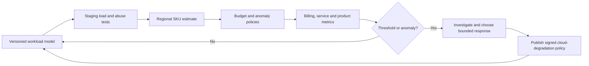

# Firebase cost and capacity controls

This document replaces fixed, unverified quotas with a measured FinOps control loop. It defines the
design; no budget, quota, Firebase project or paid service is claimed to be configured.

The machine-readable workload and alert contract is
`config/firebase/cost-model.json`.

## Principles

1. Local scanning, the local vault and local export do not depend on cloud availability or spend.
2. Google Cloud budgets generate alerts; they do not cap spend.
3. Billing is never automatically disabled because abrupt service loss can corrupt workflows,
   block deletion/recovery and still arrive after reporting delay.
4. Cost protection is layered across product entitlement, authorization, request limits, App
   Check, Security Rules, provider quotas, function scaling, bounded retries, anomaly detection and
   a signed degradation policy.
5. Values are hypotheses until linked staging/load evidence approves them.
6. Every cost decision records region, edition, SKU snapshot, currency, tax/credit treatment and
   evidence date.

## Control loop



## Budget alerts

Each billable environment has a project-scoped budget and named recipients. Staging and production
must not share one project budget.

| Signal | Provisional threshold | Response |
|---|---:|---|
| Actual spend | 50% | Verify forecast, user growth and top SKUs |
| Actual spend | 75% | Engineering/FinOps review; validate abuse and retry rates |
| Actual spend | 90% | Incident owner evaluates bounded cloud degradation |
| Actual spend | 100% | Cost incident; containment requires accountable approval |
| Forecast spend | 80% | Review before the expected breach |
| Forecast spend | 100% | Incident owner and product owner notified |

Budget notifications use email plus programmatic Pub/Sub delivery before staging billing is
enabled. The consumer is idempotent because billing notifications may be duplicated or reordered.
Alert delay and cost-reporting delay are accounted for; no workflow assumes instant notification.

## Cost anomaly detection

Initial two-dimensional filters are provisional:

| Scope | Minimum cost impact | Minimum deviation |
|---|---:|---:|
| Development/test | ₹250 | 50% |
| Staging | ₹500 | 35% |
| Production | ₹1,000 | 25% |

They are recalibrated after each pricing change, load test, launch cohort, entitlement change or
material architecture change. A low absolute-spend environment needs a low impact threshold;
production also needs service-level operational alerts because billing anomaly detection learns
from historical spend and is not an abuse firewall.

## Service safeguards

### Authentication

- India SMS region policy for initial scope;
- provider quota/throttle monitoring;
- App Check rollout and production enforcement evidence;
- generic results, persisted client backoff and approved server-side risk controls;
- alerts on SMS count, success/failure ratio, new-user ratio and cost per successful sign-in;
- an emergency response may pause new OTP acquisition but cannot revoke an existing user's local
  vault.

### Firestore

- bounded, indexed queries and page limits;
- no unbounded listeners or collection scans;
- read/write/delete metrics per canonical operation type;
- App Check plus deny-by-default Rules;
- cost tests for reconnect, retry, conflict and deletion flows;
- Query Explain or equivalent evidence for high-volume queries before production.

### Storage

- premium backup entitlement checked through Toolly policy;
- per-user allowance is a product hypothesis, not only a client check;
- ciphertext size, upload frequency and restore egress limits;
- resumable upload with stable identity and integrity verification;
- lifecycle cleanup only for approved temporary/noncurrent objects;
- no silent deletion of live user backups as a cost response.

### Functions

- one purpose and runtime identity per function;
- minimum instances default to zero unless latency evidence approves otherwise;
- explicit maximum instances, timeout, memory/CPU and concurrency per function;
- bounded event age/attempts, idempotency and dead-letter handling;
- request/body size limits and no open proxy behavior;
- alerts on invocation, active instances, errors, retries, duration and downstream operations.

Maximum instances can briefly exceed a configured value and is therefore a safeguard, not a bill
guarantee. Production values require load and downstream-capacity evidence.

### FCM, Remote Config and observability

- FCM payloads are allowlisted and generic;
- Remote Config fetch intervals and real-time connections are measured;
- Remote Config cannot authorize spend or transport a secret;
- Crashlytics/Performance remain off until telemetry approval;
- logging, metrics and traces use sampling, retention and cardinality limits.

## Cost-per-user model

Three monthly active-user scenarios are defined:

- `free-base`: minimum identity/entitlement/security operations; no document backup;
- `premium-base`: average encrypted-backup hypothesis;
- `premium-allowance-edge`: stress case for the proposed 5 GiB allowance.

For each billable SKU:

```text
scenario variable cost =
    max(0, usage - allocated free-tier share)
    × effective regional SKU price

cohort monthly cloud cost =
    active users × per-user variable cost + allocated fixed cost
```

Gross-margin review additionally includes store fees, tax, support, refunds and currency effects.
Free-tier allocation is modelled conservatively and never double-counted across projects.

Required cohorts are 100, 1k, 10k, 100k and 1m active users. Profiles include normal traffic,
launch burst, OTP abuse, backup resume storm, function retry storm and deletion backlog. The output
records service operations, regional cost, latency, retries, quota rejection, errors, storage
growth, egress and kill-switch time-to-effect.

No final premium allowance, price or gross-margin claim is approved until current regional SKUs and
staging evidence populate the model.

## Response ladder

1. verify alert authenticity and reporting period;
2. identify project, service, SKU, operation and release cohort;
3. distinguish expected growth, regression, retry amplification and abuse;
4. stop a bad deployment or isolate an abusive route;
5. tighten safe server-side rate/scaling controls within approved availability limits;
6. publish the signed `contain-cost` policy to pause new backup uploads/background sync;
7. preserve restore, deletion and security operations when safe;
8. communicate user-visible degradation if material;
9. record decision, duration, rollback and post-incident model update.

Direct console edits require a linked incident/change record and later reconciliation to source
control.

## References

- [Cloud Billing budgets and alerts](https://cloud.google.com/billing/docs/how-to/budgets)
- [Programmatic budget notifications](https://cloud.google.com/billing/docs/how-to/budgets-programmatic-notifications)
- [Cloud Billing cost anomalies](https://cloud.google.com/billing/docs/how-to/manage-anomalies)
- [Firestore usage, limits and spending note](https://firebase.google.com/docs/firestore/quotas)
- [Cloud Run maximum-instance safeguards](https://cloud.google.com/run/docs/configuring/max-instances)
- [Cloud Monitoring alerting](https://cloud.google.com/monitoring/alerts)

References were revalidated on 2026-07-23.
