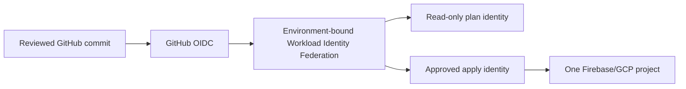

# Firebase infrastructure, secrets and access

Firebase resources are reproducible, reviewed and environment-isolated. This document is a
provisioning plan; it does not contain credentials, billing IDs, Firebase project IDs or deployed
infrastructure.

## Source layout

The implementation phase will use:

```text
infra/
  firebase/
    modules/
    environments/
      development/
      test/
      staging/
      production/
firebase.json
firestore.rules
firestore.indexes.json
storage.rules
```

- Terraform manages supported Google Cloud/Firebase resources, IAM, budgets, notifications,
  monitoring and Rules resources where supported.
- Firebase CLI/API deploys reviewed Firebase artifacts not fully supported by Terraform.
- Unsupported/manual bootstrap steps are scripts or checklists with exported before/after evidence;
  they are not silently treated as infrastructure-as-code.
- The default Cloud Storage bucket has current provisioning limitations and must not be represented
  as Terraform-managed unless the provider supports that exact operation at implementation time.

## Deployment identities



- GitHub uses Workload Identity Federation and short-lived credentials.
- Each environment has a separate identity binding and attribute condition.
- Pull requests may run read-only validation/plan; they cannot deploy.
- Staging apply requires protected-environment approval.
- Production apply requires named approval, immutable commit and release evidence.
- Service-account key creation/upload is prohibited; no JSON key is stored in GitHub.
- Runtime service identities are per function/service and receive resource-level minimum roles.
- Human access uses groups, named roles, time-bounded elevation and periodic review.
- Basic Owner/Editor roles are not routine runtime or deployment roles.

## Secrets and configuration

| Material | Storage | Rule |
|---|---|---|
| Third-party secret/private key | Secret Manager | Bind only to the function that needs the version |
| Managed Google credentials | Attached runtime identity/ADC | Do not create a key file |
| GitHub deployment identity | Workload Identity Federation | Short lived and environment bound |
| Firebase client API key | Client config with API/app restrictions | Identifier, not authorization; do not mix non-Firebase APIs |
| FCM server credential | Trusted server/managed identity | Never in client or repository |
| Policy signing private key | Approved managed signing service | Client receives public keys only |
| Non-secret operational defaults | Versioned source/Remote Config | Public, schema-validated and non-authoritative |

Sensitive values are not placed in Cloud Functions environment variables. Secret access, rotation,
revocation and deletion are logged and tested. Secret values never appear in Terraform state,
plans, CI output or application logs.

## Bootstrap and drift

1. create/approve the environment project and billing link;
2. select immutable/migration-sensitive locations;
3. enable only required APIs;
4. establish WIF, plan/apply and break-glass identities;
5. deploy deny-by-default Rules and indexes;
6. create app registrations and restricted client API keys;
7. configure service resources, budgets, anomaly/operational alerts and retention;
8. enable App Check in monitor mode and collect staging evidence;
9. reconcile exported state and attach the evidence checklist.

Scheduled drift detection compares code to project services, IAM, Rules releases, indexes, budgets,
alerts, App Check state, function scaling, Secret Manager bindings and lifecycle policies. Unknown
resources, public access, broad roles or console-only changes block production promotion.

Break-glass access is time-bounded, MFA-protected, independently alerted and followed by source
reconciliation and incident/change review. It is not a standing administrator account.

## Required CI gates

- formatting and static validation;
- Firebase governance validator;
- Terraform/provider lock and validation when IaC is introduced;
- policy-as-code for prohibited public/broad access;
- Rules unit tests in Emulator Suite;
- no secret or long-lived service-account key;
- dependency/SBOM/provenance gates;
- environment and project-binding validation;
- plan artifact bound to the reviewed commit;
- manual production approval and post-apply evidence.

## References

- [Terraform with Firebase](https://firebase.google.com/docs/projects/terraform/get-started)
- [Firebase CLI projects and aliases](https://firebase.google.com/docs/cli)
- [Firebase security checklist](https://firebase.google.com/support/guides/security-checklist)
- [Workload Identity Federation](https://cloud.google.com/iam/docs/workload-identity-federation)
- [Service-account security practices](https://cloud.google.com/iam/docs/best-practices-service-accounts)

References were revalidated on 2026-07-23.
