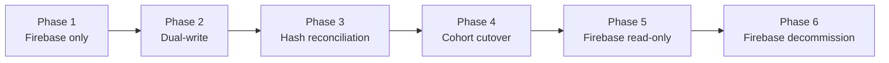

# Cloud Provider Migration Feasibility Guide

> **Status: Planning document only.** AWS migration is not part of the current product phase.
> Firebase is the approved cloud infrastructure provider for Toolly's initial product and all
> production releases. A provider migration may be evaluated approximately two years after
> launch; that timing is a planning assumption, not a committed deadline. No AWS infrastructure,
> code or dependencies should be created until a migration is formally approved.
>
> This document preserves the migration feasibility architecture described in
> [ADR-0003](../adr/0003-cloud-provider-portability.md). The procedures below describe how
> a future migration could be executed if one is ever required.

This document outlines the procedure that would be followed to migrate Toolly's cloud infrastructure from Firebase to an alternative provider. Any such migration must be executed without user data loss, without requiring users to re-authenticate and without changing the canonical document or account identity.

See [ADR-0003](../adr/0003-cloud-provider-portability.md) for the architectural rationale.

---

## Prerequisites

Before starting any migration:

- [ ] Migration formally approved — decision recorded in DECISION_REGISTER.md.
- [ ] Target cloud account created and data-residency region confirmed (India: `ap-south-1` for AWS).
- [ ] Target object storage bucket created with server-side encryption.
- [ ] Target authentication service configured.
- [ ] Provider-neutral sync contract implemented and tested.
- [ ] All Firebase SDK calls confirmed to be in the data layer only (no leakage into domain).
- [ ] Hash reconciliation tooling available and tested on a sample dataset.
- [ ] Rollback plan reviewed and tested in a staging environment.

---

## Migration phases

---

### Phase 1 — Firebase only (current state)

All reads and writes go to Firebase. No action required.

---

### Phase 2 — Dual-write

**Goal:** All new writes go to both Firebase and the target provider. Existing documents remain Firebase-only until backfill.

**Steps:**

1. Deploy the target provider data implementation behind the provider-neutral sync interface.
2. Enable dual-write in the sync engine configuration.
3. Verify that new document writes appear in both Firebase Storage and the target provider.
4. Begin asynchronous backfill of existing Firebase documents to the target provider.

**Validation:**

- New documents appear in both providers within 30 seconds.
- Backfill progress is monitored and logged (object count only; no document content in logs).

---

### Phase 3 — Hash reconciliation

**Goal:** Verify that every document in Firebase has a matching, intact copy in the target provider.

**Steps:**

1. Run the hash-reconciliation tool against the complete Firebase Storage inventory.
2. For each object, compare the SHA-256 hash of the Firebase object with the SHA-256 hash of the target provider object.
3. Re-upload any objects where hashes do not match.
4. Repeat until reconciliation passes with zero mismatches.

**Validation:**

- Zero hash mismatches before proceeding to Phase 4.
- Reconciliation report attached to the migration tracking issue.

---

### Phase 4 — Cohort cutover

**Goal:** Migrate reads for successive cohorts of users from Firebase to the target provider.

**Steps:**

1. Select an initial cohort of 1 % of users (internal team first).
2. Route reads for the cohort to the target provider.
3. Monitor error rates, latency and user reports for 48 hours.
4. If metrics are acceptable, expand to 10 %, 50 % and 100 % in successive steps.
5. If metrics degrade, roll back the cohort to Firebase reads (see Rollback section).

**Validation:**

- Error rate for target provider reads is within 0.1 % of the Firebase baseline.
- P99 read latency for the target provider is within 20 % of the Firebase baseline.

---

### Phase 5 — Firebase read-only

**Goal:** All reads are served from the target provider. Firebase is kept as a read-only backup.

**Steps:**

1. Disable dual-write (writes go to the target provider only).
2. Keep Firebase Storage in read-only mode for 30 days.
3. Continue monitoring error rates.

---

### Phase 6 — Firebase decommission

**Goal:** Remove the Firebase Storage dependency.

**Steps:**

1. Confirm all users have successfully read from the target provider (no Firebase-only reads in the last 30 days).
2. Delete Firebase Storage objects and disable Firebase Storage.
3. Remove the Firebase Storage data implementation from the codebase.
4. Update cost controls documentation.

---

## Authentication migration

An authentication migration from Firebase Auth to another provider would follow a similar pattern:

1. `ToollyAccountId` is already the canonical identity; Firebase UID is only a stored credential.
2. Issue target provider credentials to users during their next authentication session.
3. Link the new provider ID to the existing `ToollyAccountId` record.
4. Decommission Firebase Auth after all users have migrated.

---

## Rollback procedure

If any phase fails or metrics degrade:

1. Immediately revert the cohort's read routing to Firebase.
2. Stop dual-write if Phase 3 hash reconciliation has not passed.
3. Document the failure in the migration tracking issue.
4. Do not proceed to the next phase until the root cause is identified and resolved.

---

## Contacts

| Role | Name |
|------|------|
| Migration owner (if approved) | shivayogih |
| Firebase account holder | shivayogih |
