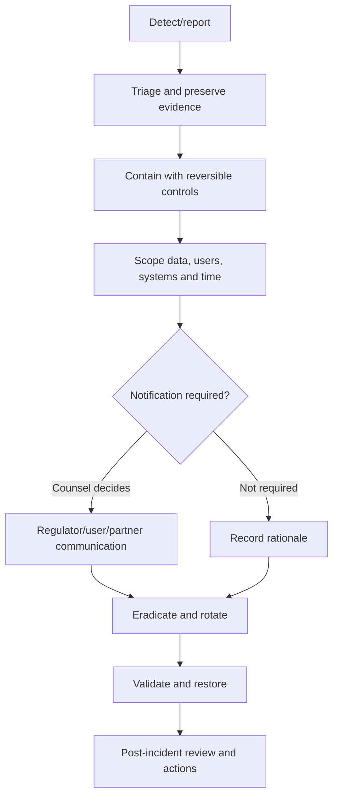

# Security Incident Response

## Purpose

Provide a repeatable response to suspected compromise of user data, keys, identity, cloud,
software supply chain or production operations. Legal notifications are directed by qualified
counsel using current law; this runbook does not invent a universal reporting deadline.

## Roles

| Role | Responsibility |
|------|----------------|
| Incident commander | Owns severity, coordination and decisions |
| Security lead | Technical investigation, containment and evidence |
| Engineering lead | Product/cloud remediation and validation |
| Privacy/legal lead | Personal-data assessment and notification obligations |
| Communications lead | Accurate user/researcher/public communication |
| Scribe | Timestamped decision/evidence log |

Named primary/backup contacts and an out-of-band channel are required before production.

## Severity

| Severity | Example |
|----------|---------|
| SEV-0 | Confirmed plaintext/key compromise at scale or malicious release |
| SEV-1 | Confirmed account takeover campaign, unauthorized sensitive access or signing compromise |
| SEV-2 | Contained vulnerability with credible sensitive impact or active abuse |
| SEV-3 | Low-impact weakness, unsuccessful probe or policy issue |

Severity can only increase during uncertainty; reduction requires recorded evidence.

## Workflow

## First actions

1. Open restricted incident record; assign commander and scribe.
2. Preserve logs/artifacts with chain-of-custody metadata; do not collect unnecessary user content.
3. Validate the signal and classify affected data/services/versions.
4. Use least-destructive containment: disable backup or sensitive endpoints, revoke credentials,
   suspend risky key operations, roll back release.
5. Preserve local scanning/export wherever safe.
6. Engage provider/store and legal/privacy contacts.
7. Begin notification assessment immediately; record facts, uncertainty and decisions.

Never ask users to send keys, OTPs, passwords or unredacted documents.

## Investigation questions

- What happened, when, and through which trust boundary?
- Which app/backend/provider versions and environments?
- Was plaintext, ciphertext, identity, key material or metadata accessed?
- Can access be proven or only exposure inferred?
- Which users/countries and how many records?
- Is attacker persistence or malicious update possible?
- Are backups, logs, exports and subprocessors affected?
- What evidence supports containment and recovery?

## Key/cloud compromise

- Freeze envelope issuance or backup writes with signed policy where safe.
- Revoke service/user/device credentials and rotate from a clean environment.
- Do not mass re-encrypt or destroy old keys until restore/forensic strategy is approved.
- Treat signing compromise as potential malicious release; coordinate store response.
- Maintain immutable local access when it does not extend compromise.

## Communication

Communications are factual, accessible and consistent. They describe known data/categories,
likely consequences, actions taken, protective steps and contact/grievance path. Legal/privacy
approves recipients and timing under current obligations. Do not delay escalation while waiting
for perfect certainty.

## Recovery and closure

Recovery requires patched root cause, rotated/revoked access, clean deployment, monitoring, restore
tests and commander/security approval. Closure requires a blameless review, timeline, root causes,
control gaps, user impact, evidence retention, owners/deadlines and threat-model updates.

## Exercises

Run before beta and at least annually:

- Firebase/project credential compromise;
- leaked plaintext in crash/log pipeline;
- OTP cost/ATO campaign;
- signing/supply-chain compromise;
- lost key or broken restore migration;
- deletion processor failure;
- researcher disclosure under embargo.
