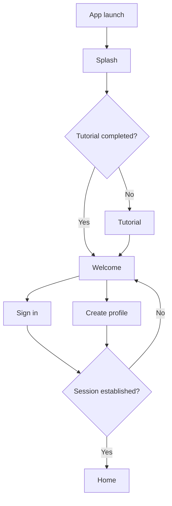
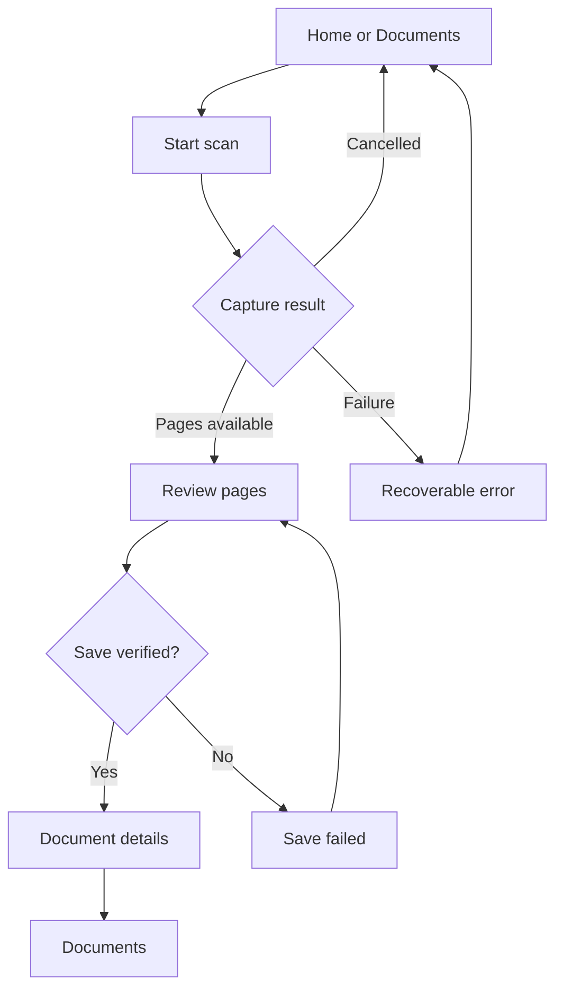

# Release Application Flow

## Purpose

This document defines Toolly's release-shaped application journey for Android phones/tablets and
iPhone/iPad. It is the canonical navigation contract for product implementation. Platform-owned
camera, permission, share and file-picker surfaces may look native, but Toolly screens, states,
decisions and outcomes remain equivalent.

## Launch and account journey

The splash screen performs no artificial wait. It exists only while local startup state is loaded.
Tutorial completion is local, non-sensitive preference data. Authentication is required before the
first scan under decision D-021.

## Authenticated product shell

| Destination | Primary outcome | Required states |
|---|---|---|
| Home | Start a scan or continue recent local work | Empty, content, busy, offline, recoverable error |
| Documents | Browse and reopen encrypted local documents | Loading, empty, content, corrupt, key unavailable |
| Tools | Enter approved offline document tools | Unavailable, eligible, processing, success, failure |
| Profile | Manage account, privacy, security and preferences | Authenticated, development session, signed out |

Compact layouts use bottom navigation. Medium and expanded layouts may use a rail or persistent
navigation region without changing destination names, order or outcomes.

## Capture-to-document journey

Save is successful only after encrypted assets and metadata are committed and authenticated
read-back succeeds. A vault error must remain visible and retryable. The application must never
display fake success, write plaintext as a fallback or hide a corrupt result to continue a demo.

## Development authentication adapter

Development access may temporarily unblock navigation while Firebase Authentication is not
configured. It is permitted only when the platform host explicitly enables it for a debug build.

The adapter:

- is local and temporary;
- performs no network request;
- stores no credential, OTP, token, profile or fake production account;
- is visibly identified as development access;
- is unavailable by default and cannot be selected by release builds;
- does not bypass permissions, vault encryption, authenticated read-back, validation or errors.

Release configuration without an approved authentication provider fails closed at Welcome/Sign in.

## State ownership

| State | Owner | Persistence |
|---|---|---|
| Tutorial completed | Toolly local preferences adapter | Local; non-sensitive |
| Current navigation | Shared presentation state | Memory/saved UI state only |
| Authentication session | Toolly authentication port | Provider/platform adapter |
| Development access | Debug platform host | Memory only |
| Documents and pages | Encrypted local vault | Encrypted source of truth |
| Capture temporary assets | Platform capture adapter | App-private, short-lived, explicit cleanup |

Firebase and future cloud providers do not own navigation, canonical account IDs, document IDs or
local document availability.

## Permission timing

No camera, files, photos, documents, notifications, contacts, microphone or location permission is
requested at splash, tutorial, welcome, sign-in, create-profile or home launch. Camera access occurs
only after **Scan document**. Export/import uses system pickers and scoped access after the related
user action. Notification permission is requested separately from account and marketing consent.

## Cross-platform parity gates

- Android phone/tablet and iPhone/iPad use the same destination and transition model.
- Toolly-owned user-facing strings come from reviewed English, Hindi and Kannada resources.
- Loading, empty, offline, error, retry and signed-out outcomes are explicit.
- TalkBack and VoiceOver announce screen titles, actions, progress and failures.
- OS-controlled surfaces are recorded in the platform parity matrix.
- No production sample user, document, identifier or test string is packaged.

## Current blockers

- Android physical-device encrypted Save fails closed with `ToollyErrorCode.CORRUPT`; tracked by
  [TLY-011A](https://github.com/toollyscan/toolly-mobile/issues/51).
- Real Firebase Authentication remains Phase 4 and is not required for the debug navigation slice.
- Apple capture and physical iPhone/iPad parity remain tracked by TLY-012A/TLY-012B.
