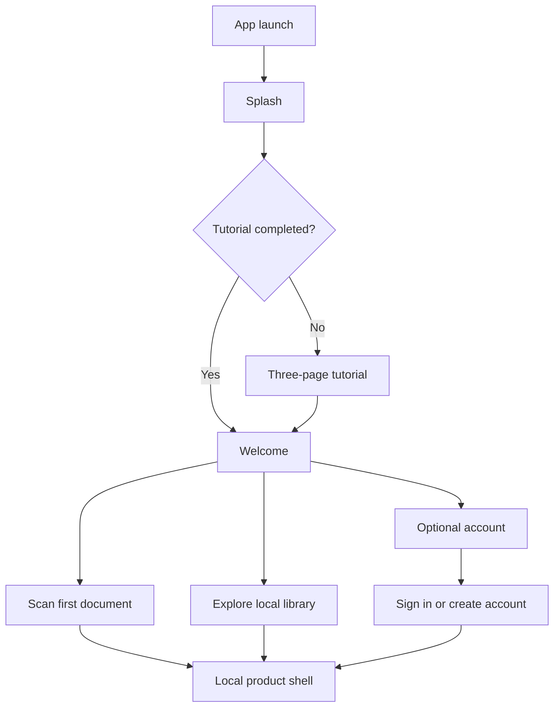
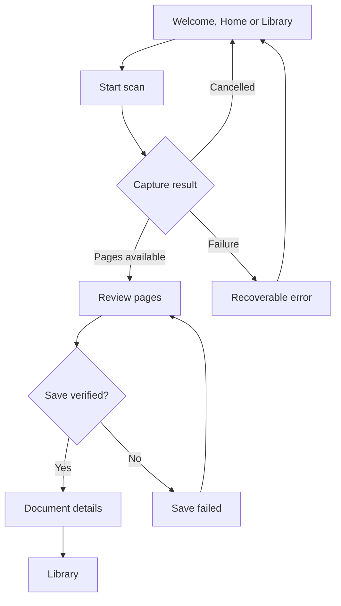

# Release Application Flow

## Purpose

This document defines Toolly's release-shaped application journey for Android phones/tablets and
iPhone/iPad. It is the canonical navigation contract for product implementation. Platform-owned
camera, permission, share and file-picker surfaces may look native, but Toolly screens, states,
decisions and outcomes remain equivalent.

## Launch and local-first journey

The Figma splash sequence may animate for up to 700 milliseconds while startup state is resolved;
it must not request permission or perform a network call. Tutorial completion is local,
non-sensitive preference data and is persisted by each platform host. Local scanning, encrypted
save, library access, viewing and local export do not require an account. Account setup is deferred
until the user chooses backup, sync, recovery or another account-owned feature.

## Product shell

| Action or destination | Primary outcome | Required states |
|---|---|---|
| Home | Start a scan or continue recent local work | Empty, content, busy, offline, recoverable error |
| Library | Browse and reopen encrypted local documents | Loading, empty, content, corrupt, key unavailable |
| Scan | Start platform capture from an explicit user action | Ready, busy, cancelled, partial, failure |
| Search | Search local titles, tags and recognized text | Empty query, results, no results, unavailable index |
| You | Manage local privacy, optional account and preferences | Local, authenticated, development session |

Compact layouts use the Figma-ordered bottom navigation: **Home, Library, Scan, Search, You**.
Medium and expanded layouts may use a rail or persistent navigation region without changing the
names, order or product outcomes. Scan remains an action rather than a durable destination.

## Capture-to-document journey

Save is successful only after encrypted assets and metadata are committed and authenticated
read-back succeeds. A vault error must remain visible and retryable. The application must never
display fake success, write plaintext as a fallback or hide a corrupt result to continue a demo.

## Optional account journey

Account entry offers phone, email and Google on Android, with Apple added on iOS. Provider SDKs and
network behavior remain behind Toolly-owned ports and the Phase 4 gate. A verified phone and
completed profile are required before account-owned backup or sync, but never before local document
work.

Development access may temporarily exercise authenticated presentation states while Firebase
Authentication is not configured. It is permitted only when the platform host explicitly enables
it for a debug build. It performs no network request, stores no credential or fake account, is
visibly identified, is unavailable in release builds and never bypasses vault or permission checks.

## State ownership

| State | Owner | Persistence |
|---|---|---|
| Tutorial completed | Toolly local preferences adapter | Local; non-sensitive |
| Current navigation | Shared presentation state | Memory/saved UI state only |
| Local-use session | Shared presentation state | Memory only; no identity |
| Authentication session | Toolly authentication port | Provider/platform adapter |
| Development access | Debug platform host | Memory only |
| Documents and pages | Encrypted local vault | Encrypted source of truth |
| Capture temporary assets | Platform capture adapter | App-private, short-lived, explicit cleanup |

Firebase and future cloud providers do not own navigation, canonical document IDs or local document
availability.

## Permission timing

No camera, files, photos, documents, notifications, contacts, microphone or location permission is
requested at splash, tutorial, welcome, account entry or home launch. Camera access occurs only
after **Scan**. Export/import uses system pickers and scoped access after the related user action.
Notification permission is separate from account creation and marketing consent.

## Visual and cross-platform parity gates

- Figma Foundations, Onboarding & Auth and Product Flows define hierarchy, branding and action
  priority.
- Android phone/tablet and iPhone/iPad use the same destination and transition model.
- Shared tokens use primary `#2961F2`, primary container `#E5ECFF`, surface `#F5F7FA`, outline
  `#C7CFD9`, secondary text `#616B78` and primary text `#1C2129`.
- Interactive targets are at least 48dp and primary actions are at least 52dp high.
- Toolly-owned user-facing strings exist in English, Hindi and Kannada resources.
- TalkBack and VoiceOver announce screen titles, actions, progress and failures.
- No production sample user, document, identifier or test string is packaged.

## Current blockers and staged limitations

- Android physical-device encrypted Save remains blocked until PR #54 is physically verified.
- The first Figma slice routes **Scan my first document** into the existing Android Library walking
  slice; direct capture hand-off remains a focused follow-up.
- Real phone/email/provider authentication remains Phase 4.
- Apple capture and physical iPhone/iPad parity remain tracked by TLY-012A/TLY-012B.
