# Subscription Lifecycle

Toolly subscription state machine and transition rules.

---

## Critical rule

Subscription expiry must never remove local documents or prevent users from exporting
documents they already own. The encrypted local vault is the source of truth for document
ownership. Billing state is advisory.

---

## States

| State | Description |
|-------|-------------|
| `Unknown` | Subscription state has never been fetched or cannot be determined. |
| `Free` | User has no active subscription; free entitlements apply. |
| `Trial` | User is in an active free trial; premium entitlements apply. |
| `PremiumActive` | User has an active paid subscription; premium entitlements apply. |
| `PremiumGracePeriod` | Billing has failed; platform is retrying; premium entitlements continue during the grace period. |
| `PremiumBillingRetry` | Grace period extended; platform is retrying payment; premium entitlements continue. |
| `PremiumPaused` | User has voluntarily paused the subscription (Google Play pause supported); reduced entitlements. |
| `PremiumExpired` | Subscription has expired; free entitlements apply; local documents unaffected. |
| `PremiumCancelledActive` | User has cancelled auto-renewal but the paid period has not yet ended; premium entitlements active. |
| `Refunded` | A refund has been issued by the platform; premium entitlements revoked; local documents unaffected. |
| `Revoked` | Subscription has been revoked (e.g. fraud, policy violation) by Toolly or the platform. |
| `StoreUnavailable` | Platform billing service is temporarily unavailable; cached state is used. |
| `VerificationPending` | Receipt has been received but server verification has not yet completed. |

---

## State diagram

```mermaid
stateDiagram-v2
    [*] --> Unknown : App first launch
    Unknown --> Free : No purchase found
    Unknown --> VerificationPending : Purchase token found

    Free --> Trial : Start free trial
    Free --> VerificationPending : Purchase subscription

    Trial --> PremiumActive : Trial converts (payment successful)
    Trial --> Free : Trial cancelled before conversion
    Trial --> VerificationPending : Payment initiated during trial

    VerificationPending --> PremiumActive : Verification succeeds
    VerificationPending --> Free : Verification fails (no entitlement granted)
    VerificationPending --> StoreUnavailable : Store unreachable

    PremiumActive --> PremiumCancelledActive : User cancels auto-renewal
    PremiumActive --> PremiumGracePeriod : Billing fails
    PremiumActive --> Refunded : Platform issues refund
    PremiumActive --> Revoked : Revocation event received
    PremiumActive --> PremiumPaused : User pauses (Google Play)

    PremiumCancelledActive --> PremiumExpired : Paid period ends
    PremiumCancelledActive --> PremiumActive : User re-enables auto-renewal

    PremiumGracePeriod --> PremiumActive : Billing retry succeeds
    PremiumGracePeriod --> PremiumBillingRetry : Grace period continues
    PremiumGracePeriod --> PremiumExpired : Grace period ends without payment

    PremiumBillingRetry --> PremiumActive : Billing retry succeeds
    PremiumBillingRetry --> PremiumExpired : All retries exhausted

    PremiumPaused --> PremiumActive : User resumes or pause period ends
    PremiumPaused --> PremiumExpired : Pause period ends without resume

    PremiumExpired --> VerificationPending : User re-subscribes
    PremiumExpired --> Free : No re-subscription

    Refunded --> Free : Post-refund state

    Revoked --> Free : Post-revocation state

    StoreUnavailable --> VerificationPending : Store recovers; pending verification
    StoreUnavailable --> Unknown : Cached state expired
```

---

## Transition definitions

### New purchase

1. User initiates purchase in app.
2. Platform billing sheet is presented.
3. On success: platform returns a purchase token.
4. App enters `VerificationPending`; the UI shows a "processing" state — premium features are
   **not** optimistically enabled until verification succeeds. This prevents a verification
   timeout or repeated failure from granting premium access without a valid entitlement.
5. App submits token to backend for verification.
6. Backend verifies with platform and records the entitlement.
7. On verification success: state transitions to `PremiumActive`; premium features enabled.
8. On verification failure: state transitions to `Free`; local documents are unaffected.
9. Verification must not block the user from accessing locally owned documents.
10. If verification is taking longer than expected, the app displays a non-blocking notice
    ("Activating your subscription…") and continues retrying in the background.

### Restore purchase

1. User taps "Restore Purchase".
2. App queries platform for existing active purchases.
3. Each found purchase token is submitted for verification.
4. On verification success: state transitions to `PremiumActive` or `Trial` as appropriate.
5. On no active purchase: state transitions to `Free`.
6. Restore must work on the same device after reinstall.

### Cross-device restore

1. User signs in on a new device with the same `ToollyAccountId`.
2. App queries backend for current entitlement state (by `ToollyAccountId`).
3. App also queries platform for active purchases linked to the platform account.
4. Entitlement is resolved from both sources; the most permissive valid entitlement applies.
5. Local vault documents are separate from cloud backup documents; restore is a distinct flow.

### Offline launch

1. App reads cached entitlement state from local vault.
2. Cached state is used if `cachedAt + freshnessPolicySeconds` has not elapsed.
3. If cache is stale (elapsed), app enters `Unknown` for cloud-dependent features;
   local features (capture, export, organisation) remain fully available.
4. When connectivity is restored, app refreshes entitlement state in the background.
5. A stale entitlement cache must never block access to locally owned documents.

### Temporary store failure

1. App attempts to verify or refresh entitlement; platform is unreachable.
2. State transitions to `StoreUnavailable`.
3. Cached entitlement is used for the duration of `freshnessPolicySeconds`.
4. App retries verification with exponential backoff.
5. On recovery: app submits pending tokens and refreshes state.
6. Local document access is unaffected throughout.

### Delayed server verification

1. Backend verification call times out or returns a retryable error.
2. State remains `VerificationPending`.
3. App retries with exponential backoff (max retries: **[H]** 5; max delay between retries:
   **[H]** 5 minutes for foreground retries; background retries may extend up to 1 hour).
   *Note: A 1-hour maximum delay is suitable only for background retry; foreground retries
   should be capped at a few minutes to avoid leaving the user waiting. See H-008.*
4. Local documents remain accessible throughout.
5. Premium entitlements are not granted until verification succeeds.

### Grace period

1. Billing fails; platform enters the grace period.
2. State transitions to `PremiumGracePeriod`.
3. Premium entitlements continue during the grace period.
4. App displays a non-intrusive notice prompting the user to update payment details.
5. App does not display scare messaging about document loss.
6. Platform retries billing automatically.
7. On success: state returns to `PremiumActive`.
8. On expiry of grace period: state transitions to `PremiumExpired`.

### Expiry

1. Subscription expires (grace period ended, or cancellation period ended).
2. State transitions to `PremiumExpired`.
3. Local documents are **not deleted**.
4. All local exports remain available.
5. Cloud backup pauses; existing backup data is retained per retention policy.
6. Advanced processing and OCR revert to free-tier limits.
7. App displays a single, respectful notice about features no longer available.
8. User can re-subscribe at any time.

### Cancellation

1. User cancels auto-renewal via platform subscription management.
2. State transitions to `PremiumCancelledActive`.
3. Premium entitlements continue until the end of the paid period.
4. At end of period: state transitions to `PremiumExpired` (see Expiry above).
5. App does not retaliate or add friction to cancellation.

### Refund

1. Platform issues a refund event.
2. State transitions to `Refunded`.
3. Premium entitlements are revoked.
4. Local documents are **not deleted**.
5. State transitions to `Free`.

### Revocation

1. Toolly or platform revokes the subscription (e.g. fraud, policy violation, developer action).
2. State transitions to `Revoked`.
3. Premium entitlements are revoked.
4. Local documents are **not deleted**.
5. State transitions to `Free`.

### Account deletion

1. User requests account deletion.
2. Toolly processes the data-deletion request per DPDP Act 2023 requirements.
3. Cloud backup is deleted per retention policy.
4. Local vault is not touched; the user must explicitly choose to delete local data.
5. Subscription is cancelled via platform; no refund is automatically issued.
6. `ToollyAccountId` and associated records are deleted from backend within the
   required retention period.

### Backup quota after expiry

1. Subscription expires.
2. Cloud backup pauses; no new uploads.
3. Existing backup data is retained for **[H]** 90 days after expiry.
4. After retention period: existing backup data is deleted; user is notified before deletion.
5. If user re-subscribes within the retention period, backup resumes from the existing data.
6. Local documents are **not deleted** at any point.

---

## Entitlement freshness policy

| Field | Description |
|-------|-------------|
| `cachedAt` | UTC timestamp when entitlement state was last successfully fetched. |
| `freshnessPolicySeconds` | Duration for which the cached state is considered valid. **[H]** 86400 (24 hours). |
| `nextRefreshAt` | `cachedAt + freshnessPolicySeconds`; app must refresh before this time. |
| `stalePolicy` | When stale: use cached state for local features; downgrade cloud features gracefully. |

The freshness policy is a hypothesis **[H-007]** requiring validation against server cost and
user experience. A shorter policy increases server load; a longer policy risks delayed
entitlement revocation.

---

## Backend verification requirements

- Verification must be idempotent (re-submitting the same token must not create duplicate records).
- Verification must not block local document access on failure.
- Verification results must be stored by `ToollyAccountId`, not by Firebase UID.
- Verification must support a future provider migration without loss of entitlement history.
- Google Play and Apple App Store transaction types must not appear in domain entitlement models.

---

## Open hypotheses

| ID | Hypothesis | Validation required |
|----|-----------|-------------------|
| H-007 | Entitlement cache freshness of 24 hours | Server cost modelling vs. entitlement staleness risk |
| H-008 | Delayed verification: 5 foreground retries at up to 5-minute intervals; background retries up to 1 hour | UX research and server cost |
| H-009 | Backup data retained for 90 days after expiry | Cloud cost and user expectations |
