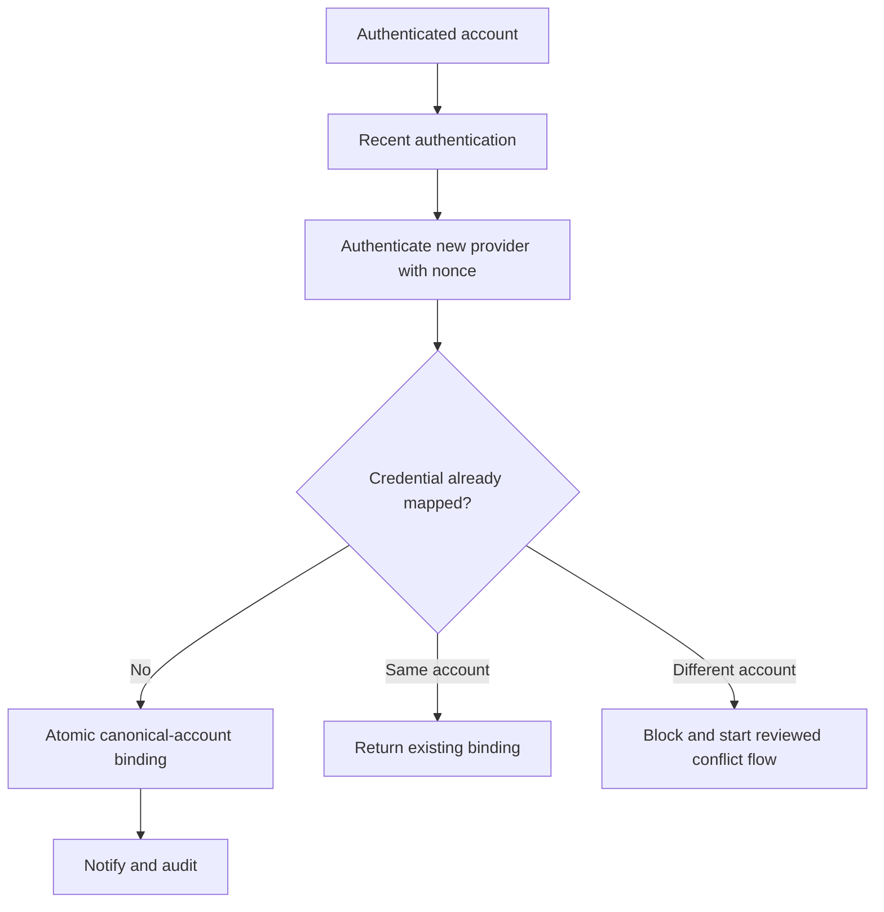

# Authentication Abuse Controls

Toolly supports phone OTP, email/password, Google and Apple Sign In on iOS. Controls are layered;
no client-side check or provider feature is sufficient alone.

## Common controls

- Generic UI/API responses for sign-in, linking and recovery.
- Toolly account mapping is authoritative; provider UID is a credential reference.
- Recent authentication and step-up for linking, deletion, recovery and key/device changes.
- App Check/device integrity where supported, introduced through monitor-then-enforce rollout.
- Server-side per-account, keyed-identifier, device, network and global cost/risk limits.
- Persisted progressive backoff that a new OTP/request does not reset.
- Idempotency and single-use challenges for sensitive operations.
- Session/token revocation after account security events.
- Privacy-safe security audit events and anomaly alerts.
- Signed kill switches for expensive remote operations without disabling local work.

Exact thresholds remain operational configuration and require abuse/load evidence. They are not
hard-coded product contracts.

## Phone OTP

- Explicit notice/consent before sending the number to Firebase Authentication.
- India-only SMS region policy for the initial launch unless product scope changes.
- Firebase and Toolly layered quotas; resend UI honours provider/server result.
- OTP values never persist in Toolly storage or logs.
- Test numbers/codes exist only in non-production configuration.
- App verification cannot be disabled in production.
- OTP is not treated as phishing-resistant and is not sufficient to release backup keys.
- SIM change, number recycling and account linking are handled as takeover risks.

Official Firebase documentation states phone numbers are sent/stored by Google for spam and abuse
prevention; this must appear in the notice and processing inventory.

## Email/password

- Use provider capabilities for secure verifier storage and breached/common password protection
  where available.
- Avoid arbitrary composition rules; permit password managers and paste.
- Passwords never pass through Toolly backend, logs, analytics or crash reporting.
- Password reset and email change generate security notifications.
- Sensitive actions require recent authentication.
- Credential-stuffing controls do not reveal account existence.

## Google and Apple

- Validate issuer, audience, nonce/state and redirect/application binding through supported SDKs.
- Request the minimum scopes.
- Do not use display email as canonical identity.
- Linking requires proof of the existing account and the new provider.
- Handle provider email changes, hidden relay email and revoked consent.
- Tokens remain inside the authentication adapter.

## Account linking

Automatic merging based only on matching email or phone number is forbidden.

## Risk outcomes

Controls return Allow, StepUp, Delay, Deny, LockedPendingReview or Unknown. Risk details are not
shown to attackers. Unknown fails closed for remote/key-sensitive actions while preserving access
to already-owned local documents.

## Required test matrix

- enumeration across every auth/recovery response;
- OTP flood, resend reset, distributed network and cost exhaustion;
- password spray and breached-password behavior;
- OAuth nonce/state/audience/redirect substitution;
- cross-account provider linking and replay;
- token/session revocation and stale-device behavior;
- App Check absent/invalid/rollout behavior;
- account deletion/recreation and recycled phone/email;
- offline returning-user access;
- logs/crash/analytics contain no identity, OTP, token or password.
