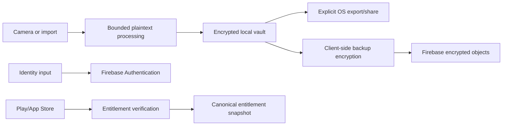

# Data Inventory and Processing Register

This register is a technical inventory, not a legal determination. Purpose, legal basis, notice,
retention and processor terms require qualified privacy counsel before launch.

## Classification

| Class | Meaning | Examples |
|-------|---------|----------|
| C0 Public | Intended public product data | App version, public help text |
| C1 Internal | Non-user confidential operations | Build/run identifiers |
| C2 Personal | Identifies or relates to a person | Email, phone, provider account |
| C3 Sensitive content | User document content/metadata | Pages, OCR, titles, PDFs |
| C4 Secrets | Can grant access or decrypt | Tokens, keys, recovery material |

## Product data

| Data | Class | Purpose | Location | Cloud/processor | Telemetry | Retention status |
|------|-------|---------|----------|-----------------|-----------|------------------|
| Source/processed images | C3 | Scan/edit/export | Local vault | Ciphertext only when backup enabled | Prohibited | User controlled; legal policy pending |
| PDFs and OCR index/text | C3 | Export/search | Local vault | Ciphertext only if backed up | Prohibited | User controlled; policy pending |
| Title, folder, page order | C3 | Organisation | Local vault | Encrypted metadata if backed up | Prohibited | Follows document lifecycle |
| Canonical document/revision IDs | C1/C2 | Integrity/sync | Vault | Encrypted or access-controlled metadata | Prohibited as analytics identity | Tombstone policy pending |
| `ToollyAccountId` | C2 | Ownership | Vault/account service | Toolly cloud metadata | No raw analytics | Account lifecycle |
| Device public key/reference | C2 | Trusted-device security | Vault/account service | Toolly security record | Prohibited | Revocation plus audit policy pending |
| Local device preferences | C1/C2 | App behavior | Local | No unless explicit sync | Allowlisted non-sensitive only | Until reset/deletion |

## Identity and entitlement data

| Data | Processor/location | Toolly persistence | Security rule | Deletion evidence |
|------|--------------------|--------------------|---------------|-------------------|
| Phone number | Firebase Authentication; official documentation currently says US processing | Avoid duplication unless approved | Never logs/analytics | Delete provider user and verify Toolly records |
| Email/password verifier | Firebase Authentication | No password storage | Never enters Toolly logs | Provider deletion workflow |
| Google/Apple provider identity | Firebase Authentication/identity provider | Opaque mapped credential reference only | No provider token in domain | Unlink/delete tests |
| IP/user agent for auth abuse | Firebase provider processing | Toolly may store keyed abuse bucket only if approved | Short, purpose-limited | Provider terms plus Toolly retention |
| Store transaction/receipt | Play/App Store and verifier | Protected provider record mapped to snapshot | No receipt/token telemetry | Store/legal retention pending |
| Entitlement snapshot | Toolly | Canonical history | Cannot gate local ownership | Account policy pending |

## Operational data

| Data | Allowed fields | Prohibited fields | Retention owner |
|------|----------------|-------------------|-----------------|
| Crash diagnostics | App/build, OS, device-class bucket, safe stack trace | Content, titles, identity, tokens, paths | Engineering/privacy |
| Performance | Operation name, duration/memory/size bucket, outcome | Document IDs/content, network URL parameters | Engineering/privacy |
| Security events | Event type, coarse time, risk outcome, keyed short-lived correlation | Raw phone/email/IP/token/recovery/key | Security/privacy |
| Support tickets | User-provided description and approved attachments | Unrequested documents/credentials | Support/privacy |
| CI logs | Build metadata and test fixtures | Secrets, production data, real identity | Engineering/security |

## Data flow

## Field onboarding gate

No new field is collected or transmitted until its owner records:

1. purpose and product necessity;
2. classification and data principal;
3. collection source and destination;
4. processor/subprocessor and service location;
5. notice/consent or other legal basis for counsel review;
6. retention trigger and deletion method;
7. access roles and security controls;
8. export/correction behavior;
9. telemetry prohibition/allowlist;
10. test and accountable owner.

## Prohibited processing

- document or OCR content in analytics, advertising, model training or support by default;
- silent cloud backup or processing;
- shared advertising identifiers or cross-app tracking;
- raw identity as telemetry correlation;
- support/operator access to encryption or recovery secrets;
- production personal data in development, CI, demos or benchmark fixtures;
- new Firebase/Google services without inventory and privacy review.

## Source status

Firebase facts must be rechecked against the service-specific terms before configuration and
release. The initial inventory used Firebase's official privacy/security documentation and phone
authentication documentation, accessed 2026-07-23.
