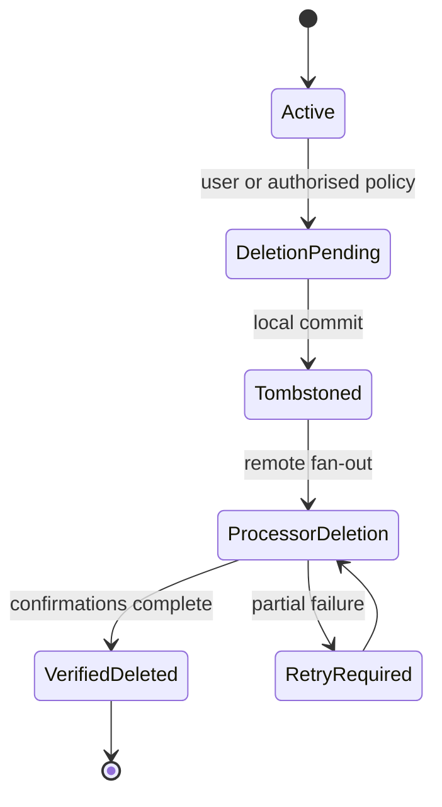

# Retention, Deletion and Export Contracts

This document defines technical behavior. Exact retention periods, legal basis and statutory
timelines require qualified legal review and a versioned policy before launch.

## Principles

- Keep data only for a recorded purpose and lifecycle.
- Local ownership is independent of subscription.
- Account deletion, document deletion, backup disable and consent withdrawal are distinct actions.
- Deletion is idempotent, resumable and verifiable across every processor.
- Security/audit retention is minimised and cannot become shadow product data.
- Export is explicit, local-first and does not silently enable cloud backup.

## Lifecycle states

## Document deletion

1. Reauthenticate only when proportional to the destructive scope.
2. Commit a local tombstone and outbox operation atomically.
3. Stop new references and show undo only within an approved local policy.
4. Remove local bytes after reference and recovery checks.
5. Delete encrypted cloud objects when backup is enabled.
6. Retain only the minimum tombstone needed to prevent resurrection.
7. Record privacy-safe completion/failure state.

## Backup disable and consent withdrawal

Disabling backup stops new uploads immediately and does not delete local content. The user chooses
whether existing encrypted backup is retained or deleted, subject to the approved notice/policy.
Withdrawal cannot be harder than enabling the optional processing.

## Account deletion

The orchestrator:

- obtains recent authentication and explicit confirmation;
- freezes new cloud mutations while preserving local export before confirmation;
- revokes sessions/devices and key-envelope delivery;
- deletes Toolly account mappings and encrypted cloud objects;
- deletes Firebase Authentication user and other processor records where supported;
- cancels or disconnects services under store/provider rules;
- tracks each processor independently with idempotent retries;
- provides a non-sensitive receipt/status reference;
- never claims complete deletion until all required confirmations or documented exceptions exist.

Firebase Authentication deletion and Toolly record deletion are separate operations.

## Local vault choice

Account deletion UI must distinguish:

- delete cloud/account but keep an explicitly local-only export or vault where technically safe;
- delete local vault from this device;
- export before deletion.

The final product behavior requires security/usability/legal review. Toolly cannot remotely
guarantee deletion from lost, offline, previously trusted or third-party destination devices.

## Export

Export supports a human-usable index plus user-owned documents in documented formats. It:

- runs locally where possible;
- requires sufficient storage and explicit destination;
- stages safely and cleans partial output;
- includes no internal keys, tokens, provider IDs or security logs;
- reports unsupported/corrupt items without omitting them silently;
- does not weaken normal PDF/JPEG export after subscription expiry.

Portable account/metadata export format and machine-readable schema require a product decision.

## Retention policy registry

Each record class must define:

| Field | Requirement |
|-------|-------------|
| Purpose | Specific approved use |
| Start trigger | Creation, use or event |
| End trigger | Deletion, expiry, revocation or legal trigger |
| Active duration | Approved maximum |
| Backup/log lag | Processor-specific verified behavior |
| Legal hold | Authority, scope and expiry |
| Deletion method | API, crypto-erasure, overwrite or provider workflow |
| Verification | Evidence and owner |

No `forever` or unspecified production retention is allowed. Unknown policy blocks new cloud
collection, not access to existing local documents.

## Required tests

- deletion retry after each processor fails;
- duplicate and out-of-order deletion events;
- offline/lost device and stale backup restore;
- subscription expiry does not delete content;
- backup disable during upload;
- account recreation with old provider identity;
- export under low storage/interruption/corruption;
- tombstone prevents resurrection;
- deletion status contains no sensitive payload.
