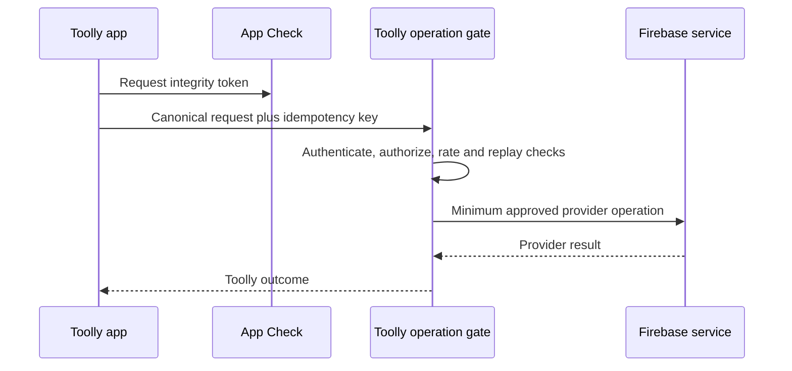

# Firebase abuse and signed operational-policy controls

Controls are layered. Client delays, App Check, provider quotas, Security Rules or a budget alert
cannot independently prevent abuse or authorize an operation.

## Abuse decision path



The operation gate returns `Allow`, `StepUp`, `Delay`, `Deny`, `LockedPendingReview` or `Unknown`.
Unknown fails closed for new remote and key-sensitive operations while preserving an authenticated
returning user's local vault access.

## Phone OTP

Phone OTP has direct user-acquisition cost and account-takeover risk. The production design uses:

- India-only SMS region policy for the initial market unless product scope changes;
- Firebase provider quotas and observed throttling;
- App Check for Firebase Authentication after valid-client metrics;
- provider-supported app verification with no production bypass;
- generic UI outcomes and persisted resend backoff;
- privacy-safe keyed counters at account, phone-identifier, device/risk, network and project level
  where an approved server control can enforce them;
- global SMS rate/cost anomaly alerts and an incident runbook;
- test phone numbers only in development/test, never production;
- explicit consent/notice before sending a phone number to Firebase.

Client resend controls are usability controls and are bypassable. Security Rules do not govern
Firebase Authentication SMS sends, and App Check is not claimed to provide per-user authorization.
Any custom preflight or Identity Platform control must be proven against the actual SDK flow in
staging before Toolly claims server-enforced SMS limits.

No numeric OTP threshold is a permanent application constant. Initial thresholds are operational,
environment-specific, versioned and approved only after abuse/load evidence.

## Lifecycle and replay resistance

Every state-changing remote operation includes:

- stable `OperationId` and idempotency key;
- canonical account, aggregate and expected revision;
- operation schema/version;
- issued time, expiry and bounded clock policy where appropriate;
- challenge or event identity for single-use actions;
- transactional dedupe record and side-effect state;
- retry class, maximum age/attempts and permanent failure outcome.

The same identity with the same payload is idempotent. The same identity with different payload,
account, environment or expected revision is rejected as an integrity event.

Account linking, deletion, entitlement events, backup completion and operational-policy updates
have dedicated replay tests. Provider retries never define Toolly product policy.

## Signed operational policy

The contract is `config/firebase/operational-policy.schema.json`.

Remote Config transports a public envelope:

```text
schemaVersion + environment + generation + issuedAt + expiresAt
+ keyId + signatureAlgorithm + canonical payload + signature
```

The payload selects one of three modes:

| Mode | Background sync | New backup upload | Restore | Local scan/vault/export |
|---|---|---|---|---|
| `normal` | Allowed by normal policy | Allowed by normal policy | Allowed | Always available |
| `contain-cost` | Paused | Paused | Allowed when safe | Always available |
| `contain-incident` | Paused | Paused | Paused unless explicitly safe | Always available |

Account-deletion intent is never discarded. If the remote route is unavailable, Toolly persists the
request locally, prevents new related cloud mutations where safe and resumes the idempotent
deletion workflow when an approved route returns.

### Verification

Clients:

1. parse with exact schema and reject unknown required semantics;
2. bind the envelope to the build environment;
3. verify a reviewed signature over versioned canonical bytes;
4. accept only a strictly newer generation unless reinstall/recovery policy proves continuity;
5. validate issue/expiry under a bounded-clock policy;
6. verify key ID, algorithm allowlist and key revocation;
7. persist the last accepted generation atomically;
8. use safe defaults on any failure.

The signing key remains in an approved managed signing service. Clients carry public verification
keys only. Algorithm, canonicalization and key-rotation implementation require dependency review,
test vectors and qualified security review; this design does not authorize custom cryptography.

## App Check rollout

For each supported service:

1. integrate the real provider in staging;
2. monitor valid, invalid and reused-token metrics;
3. test unsupported/outdated clients and rollback;
4. enable baseline enforcement before public launch;
5. enable replay protection only after limited-use-token coverage and service support are proven;
6. alert on sustained unverified or reused-token changes.

Debug providers and tokens are restricted to development/test. They are prohibited in staging and
production builds and project configuration.

## Required tests

- OTP flood by account, keyed phone identifier, device/risk, network and project;
- resend/reinstall/clock-change bypass;
- absent, invalid, expired and reused App Check token;
- duplicate, delayed, reordered and cross-environment events;
- same idempotency key with altered payload;
- signed-policy invalid signature, unknown key, rollback, expiry and environment substitution;
- policy fetch outage and corrupt cache;
- cost and incident modes preserve local scan, vault read/write and export;
- backup resume storm and deletion during each cloud mode;
- no identity, OTP, token, path or payload in logs/alerts.

## References

- [Firebase Authentication limits](https://firebase.google.com/docs/auth/limits)
- [Firebase App Check enforcement](https://firebase.google.com/docs/app-check/enable-enforcement)
- [Cloud Functions retry and idempotency guidance](https://firebase.google.com/docs/functions/retries)
- [Firebase Remote Config policies](https://firebase.google.com/docs/remote-config)

References were revalidated on 2026-07-23.
