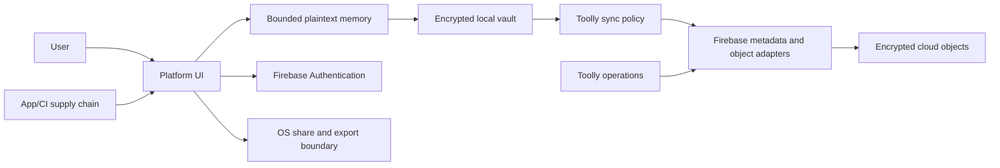

# Threat Model

## Scope

This model covers the Android and iOS apps, local encrypted vault, processing pipeline,
authentication, optional encrypted backup, entitlement verification, Firebase adapters,
operational tooling and support workflows. Store consoles, employee endpoints and CI are included
where they can affect production data.

This is a design baseline. A qualified mobile security practitioner must validate it against the
implemented system before beta and after material architecture changes.

## Security objectives

1. Preserve confidentiality and integrity of document content on lost, stolen or compromised
   storage.
2. Preserve access to locally owned documents during network, provider and billing failures.
3. Prevent cloud, support and analytics systems from receiving plaintext document content.
4. Prevent account takeover from silently granting access to encrypted backup.
5. Make every destructive or security-sensitive action authenticated, replay-safe and auditable.
6. Minimise identity data and provide testable deletion, export and consent controls.
7. Keep provider compromise from redefining Toolly ownership or canonical identity.

## Assets

| Asset | Sensitivity | Required protection |
|-------|-------------|---------------------|
| Source/processed pages, PDFs, OCR text | Critical | Encrypted at rest; plaintext only in bounded memory |
| Asset and metadata keys | Critical | Versioned hierarchy; platform-protected wrapping |
| Recovery material | Critical | User-controlled; never available to support |
| Provider tokens and sessions | Critical | Infrastructure boundary; no logs/analytics |
| Phone/email/provider identity | High | Purpose-limited provider processing |
| Document titles, folders and metadata | High | Vault only; prohibited telemetry |
| Account, device and revision IDs | Medium | Scoped access; no public correlation |
| Entitlement history | Medium | Integrity, idempotency and minimisation |
| Security logs | High | Allowlisted fields, restricted access and retention |
| Build/signing/cloud credentials | Critical | Managed secrets, least privilege and rotation |

## Actors

- legitimate user and trusted devices;
- person with temporary or permanent physical device access;
- malicious app on the device;
- network attacker;
- credential-stuffing, OTP/SMS and account-enumeration attacker;
- abusive authenticated user or automated client;
- compromised dependency, build system or update channel;
- cloud/provider administrator or compromised provider account;
- malicious or mistaken Toolly operator/support user;
- researcher acting in good faith;
- attacker with access to exported/shared plaintext chosen by the user.

## Trust boundaries

Plaintext crossing the export boundary is an explicit user action. Firebase Authentication
processes provider identity data; document adapters must receive ciphertext only.

## Threat scenarios and required controls

| ID | Scenario | Primary controls | Evidence |
|----|----------|------------------|----------|
| T-01 | Lost/unlocked device exposes vault | Platform access control, local encryption, screen protection policy | Device tests and security review |
| T-02 | Filesystem/backup extraction | Encrypted assets/metadata, OS backup exclusions, no plaintext temp files | Static/dynamic storage tests |
| T-03 | Memory/screenshot/keyboard leakage | Bounded buffers, zeroisation where meaningful, secure UI policy, input controls | Platform test profile |
| T-04 | Tampered asset or manifest | AEAD/integrity envelope, digest/reference verification, quarantine | Fault injection |
| T-05 | Nonce/key reuse | Versioned key hierarchy, unique-use contract, key usage limits | Property and concurrency tests |
| T-06 | Stolen token/account takeover | Short scoped sessions, reauthentication, device approval, revocation | Auth/recovery test suite |
| T-07 | SIM swap/SMS interception | Phone OTP not sufficient for backup-key release; alternate providers | Threat exercise |
| T-08 | Credential stuffing/password spray | Provider controls, password policy, progressive risk controls | Staging abuse test |
| T-09 | OTP/SMS cost abuse | App Check, region policy, layered rate limits and budget kill switch | Load/abuse evidence |
| T-10 | Account/provider linking takeover | Recent authentication, proof of both identities, conflict-safe linking | Contract tests |
| T-11 | Malicious cloud object overwrite | Immutable IDs/revisions, expected-parent check, conflict preservation | Emulator tests |
| T-12 | Replay of upload/delete/recovery | Stable idempotency, nonce/challenge and replay ledger | Replay tests |
| T-13 | Cloud/operator reads documents | Client-side encryption; no server plaintext path or key custody | Architecture and traffic review |
| T-14 | Sensitive telemetry/crash leakage | Deny-by-default telemetry schema, sanitisation and CI tests | Negative tests |
| T-15 | Dependency/build compromise | Review, lock/verify, SBOM, protected signing and provenance | TLY-007/TLY-009 |
| T-16 | Support impersonation/social engineering | Support cannot reset encryption; verified workflow and audit | Tabletop exercise |
| T-17 | Incomplete deletion resurrects data | Tombstones, processor inventory and deletion verification | Lifecycle tests |
| T-18 | Malicious document parser input | Size/type limits, sandboxed parsing, fuzzing and timeouts | Fuzz corpus |
| T-19 | Root/jailbreak/debug/tampered client | Risk signal, server authorization, no secret embedded as trust root | MASVS assessment |
| T-20 | Denial of service/storage exhaustion | Quotas, bounded concurrency, disk preflight and safe recovery | Stress/fault tests |

## Privacy threat analysis

| Privacy risk | Control |
|--------------|---------|
| Linkability across services | Canonical IDs are scoped; no advertising identifier |
| Identifiability in telemetry | No raw/stable user ID; coarse buckets and short retention |
| Undetectable processing | Just-in-time notice and settings inventory |
| Secondary use | Purpose register and processor/service approval |
| Over-collection | Data inventory and field-level allowlists |
| Loss of user control | Consent withdrawal, export, deletion and backup toggle |

## Assumptions that require validation

- Platform-protected key capabilities vary across devices and cannot be described as universally
  hardware-backed.
- Root/jailbreak detection is a risk signal, not a security boundary.
- End-to-end encrypted backup is not approved until envelope, recovery and restore evidence passes.
- No claim is made that memory can be perfectly erased on managed runtimes.
- Exported plaintext is controlled by the destination app/OS after explicit user sharing.
- Firebase service locations and retention vary by service and configuration.

## Verification profile

Use the current OWASP MASVS categories for storage, cryptography, authentication, network,
platform, code, resilience and privacy. Remote APIs also require an appropriate server-side
security standard. Record exact MASVS/MASTG versions and test IDs in the assessment report.

## Review cadence

Review this model:

- before the first production walking slice;
- before beta and GA;
- when auth, key hierarchy, backup, processing or telemetry changes;
- after a security incident or material provider change;
- at least annually after launch.
