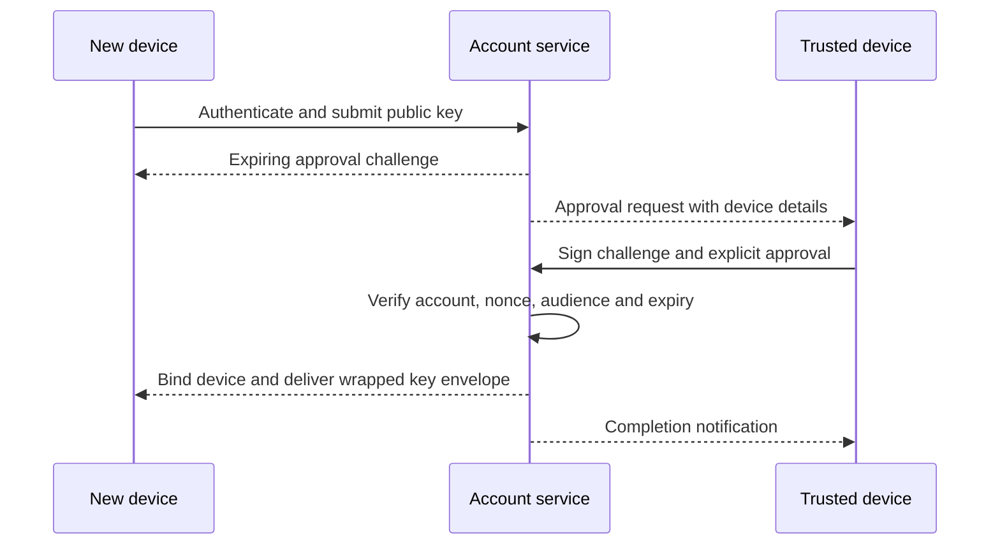

# Trusted Device and Account Recovery

## Separate recovery domains

Toolly separates:

1. **Identity recovery** — regaining access to a Firebase-backed Toolly account.
2. **Encrypted-backup recovery** — obtaining key access to decrypt optional backup.
3. **Local-device recovery** — opening an existing local vault under platform policy.

Success in one domain does not automatically satisfy another. In particular, SMS, password or
provider sign-in alone must not release encrypted-backup keys.

## Device identity

Each app installation creates a Toolly `DeviceId` and asymmetric device key through a
platform-protected adapter. The private key is non-exportable where supported and never sent to
Toolly. The server stores the public key, key capability metadata, account binding, status and
audit timestamps.

Hardware protection is a measured capability, not a universal claim. Unsupported devices follow a
reviewed fallback or are excluded from encrypted backup; they are never silently treated as
equivalent.

## Initial device

The first device becomes account-initial only after:

- successful approved-provider authentication;
- account mapping to `ToollyAccountId`;
- app/device integrity checks as configured;
- signed server challenge proving possession of the device key;
- explicit creation confirmation;
- security notification to available verified channels.

Initial-device registration does not by itself enable backup or create recovery material.

## Adding a device

The challenge is single-use, account/audience/device bound, short-lived and recorded in a replay
ledger. Approval shows platform, coarse location/time and a user-verifiable comparison. Blind push
approval is forbidden.

## Recovery path

When no trusted device is available, encrypted-backup recovery requires user-held high-entropy
recovery material or another independently reviewed mechanism. Exact format, entropy, derivation
and UX remain proposed until cryptographic and usability review.

Required properties:

- generated on the client from an approved random source;
- never available in plaintext to Toolly, Firebase, support or analytics;
- confirmation before backup is considered recoverable;
- clear warning that loss may make encrypted backup unrecoverable;
- recovery attempt is rate-limited, replay-safe and notified;
- successful recovery rotates relevant wrapping material and revokes old sessions as policy
  requires;
- support cannot override the cryptographic boundary.

Security questions, document upload to support, SMS-only key recovery and operator-created bypass
keys are rejected.

## Lost recovery material

If the user still has a trusted device, they can generate a new recovery enrollment and revoke the
old envelope after reauthentication. If no trusted device or recovery material exists, Toolly may
restore account identity but cannot promise decryption of existing encrypted backup. The UI must
state this before backup is enabled.

## Device lifecycle

States: Pending, Trusted, Suspended, Revoked, RecoveryPending and Unknown.

- Revocation blocks future key-envelope delivery and cloud access.
- Revocation cannot remotely guarantee erasure of data already decrypted on that device.
- Device removal requires recent authentication and explicit confirmation.
- High-risk events can suspend cloud/key operations without blocking the current local library.
- Account deletion revokes all devices and schedules identity/cloud deletion under the lifecycle
  contract.

## Abuse and support controls

- Generic responses prevent device/account enumeration.
- Approval/recovery requests have per-account, per-device, network and cost controls.
- Support sees only minimum audit state and cannot see documents, keys or recovery material.
- Every bind, approval, denial, recovery, rotation and revocation creates an allowlisted security
  event.
- Notifications do not contain sensitive document or identity data.

## Required evidence

- threat review for device theft, SIM swap, email compromise and malicious support;
- device-key capability matrix on representative Android/iOS devices;
- replay, expiry, cross-account and challenge-substitution tests;
- recovery brute-force cost and rate-limit tests;
- lost-device, lost-recovery and partial-restore usability studies;
- key rotation and revocation drills;
- accessibility/localization review in English, Hindi and Kannada;
- independent cryptographic design review.
